**TSVG Series High-voltage Static Var Generator** 

**User Manual **

**Preface** 

This  User  Manual  (hereinafter  referred  to  as  the  Manual)  contains contents  concerning  product  profile,  transportation  and  installation,  basic operation,  troubleshooting,  routine  maintenance  and  precautions.  To  ensure correction  operation,  please  read  carefully  the  Manual  before  operation, especially the safety requirements and instructions. 

The Manual will be provided together with the TSVG series high-voltage static var generator. Please refer to the Manual for operation and maintenance of  the  product.  We  reserves  the  right  to  upgrade  and  improve  subsequent products and modify the Manual without prior notice. 

2 

TSVG Series High-voltage Static Var Generator User Manual 

**Safety Requirements** 

**Important Note**

Please read carefully relevant chapters of the Manual before operation and 

setting.  

The TSVG series high-voltage static var generator cannot be used before debugged  by  an  engineer  authorized.  Any  damage  arising  from  use  before debugging is not covered by warranty. 

**Safety Instructions** 

For better use of the Manual and understanding of the product, please read carefully the following symbol description:  

**Warning! ![ref1]**

“Warning!” in the Manual intends to present matters that may cause death or serious personal injury if relevant requirements are not observed or corresponding measures not taken. 

**Attention! ![ref2]**

“Attention!” in the Manual intends to present matters that may cause minor or moderate personal injury if relevant requirements are not observed or corresponding measures not taken. 

**Electric Shock! **

“Electric Shock!” in the Manual intends to present positions with 

electric shock hazard that may cause death or serious personal 

injury if relevant requirements are not observed or corresponding measures not taken. 

**Grounding! **

“Grounding!”  in  the  Manual  intents  to  indicate  protective grounding. 

- The Manual shall be read carefully before installation and operation of TSVG  series  high-voltage  static  var  generator.  The  Manual  contains information necessary for giving full play to the functions of the product and avoiding faulty operation. 
- These safety instructions are applicable to all operations of the TSVG series high-voltage static var generator, and if ignored, personal injury or even death may be caused.  
- Only  certified  personnel  familiar  with  relevant  electrical  rules  and regulations and specialized in electrical work shall be allowed to provide installation and maintenance services for the product.  
- The Manual describes the characteristics of the product, but is generally not a warranty for the product. In case of any question during use, please timely contact with us. 

**General** 

**Warning!**

- The product has high voltage shock hazard. If the any provision under “Warning” is not observed or operation not carried out according to the requirements  herein,  heavy  property  loss,  serious  personal  injury  or death may be caused.  
- Only  certified  professionals  are  allowed  to  operate  the  product,  and operator  shall  be  familiar  with  all  safety  instructions  and  relevant provisions  for  installation,  operation  and  maintenance  herein  before using  the  product.  Proper  handling,  loading/unloading,  emplacement, installation, operation and maintenance are reliable guaranty for safe and successful operation of the product. 
- The product is high-voltage equipment, so any high-voltage operation shall  be  carried  out  in  accordance  with  correct  procedure  and high-voltage operation personnel and safety officers shall be specially assigned  by  the  user  on  site,  or  else  heavy  property  loss,  serious personal injury or death may be caused.  
- Pay  attention  to  electric  shock  hazard.  Even  if  high-voltage  power supply is cut off, there may be dangerous DC voltage remaining on the DC  busbar  and  DC  capacitor  of  the  power  unit  of  TSVG  series high-voltage static var generator, so the cabinet door of the TSVG series high-voltage  static  var  generator  shall  not  be  opened  before  residual electricity on the capacitor at the DC side in the power unit is clearly discharged (usually 30 minutes after high-voltage power supply is cut off) and it is confirmed that the main switch of disconnector is open and the grounding switch is closed. 
- Pay attention to electric shock hazard. In case of grounding failure, the fault  of  the  part  or  system  connected  thereto  may  cause  a  voltage difference  equal  to  the  phase  voltage  between  the  enclosure  and  the ground.  In  this  case,  contact  with  the  enclosure  and  the  ground simultaneously may cause serious personal injury or even death. 

|`   `**Attention!![ref2]**|
| - |
|
- Keep the product away from the public, especially the children! 

- The  product  can  only  be  used  for  the  purpose  as  specified  by  the manufacturer. Unauthorized upgrading or use of spare and accessory parts other than those sold or recommended by the manufacturer of the product may cause fire, electric shock or other injuries or damages. 

- Please keep the Manual at an easily accessible position near the product for convenience of use.  
|
- Measurement or test of the product at operating state and with power on must be carried out in compliance with the provisions of the Safety Regulations VBG 4.0, especially those for “allowable safety distance for working on live parts” in Section 8 thereof. During actual operation, proper electronic apparatus shall be used. 
- Before installation and debugging of TSVG series high-voltage static var generator, please read carefully the safety rules and precautions and all warning signs affixed to the product. Warning signs shall be set at a striking  position  and  those  falling  off  or  damaged  shall  be  timely replaced. 

**Transportation and storage** 

|**Warning!![ref1]**|
| - |
|u  Proper transportation, storage, emplacement and installation and careful operation and maintenance are crucial for normal and safe operation of the TSVG series high-voltage static var generator. |

|**Attention!![ref2]**|
| - |
|u  During transportation and storage, the TSVG series high-voltage static var generator shall be protected from physical shock and vibration, rain water damage and overheat. |

**Debugging** 

**Warning!![ref1]**

- Operation  by  untrained  or  unqualified  operator  or  not  in  compliance with relevant provisions in “Warning” may cause serious personal injury or  heavy  property  loss.  Operation  can  only  be  carried  out  by professionals having received training in design, installation, debugging and operation of the product and been certified as qualified for such operation. 
- Incoming power line can only adopt permanent connection. The product must be grounded (according to IEC 536 Class 1, NEC or any other applicable standard). 
- Even if the high-voltage static var generator is at non-operating state, dangerous voltage may exist at the following terminals:  

—High-voltage power input terminal 

—DC busbar in the cabinet and DC capacitor connected thereto

|**Attention!![ref2]**|
| - |
|u  Power and control cables shall be connected to the product according to the method as shown in the figures herein to prevent interruption due to operation of the TSVG series high-voltage static var generator. |

**Operation** 

|**Warning!![ref1]**|
| - |
|
- The  TSVG  series  high-voltage  static  var  generator  operates  at  high voltage.  

- Dangerous voltage inevitably exists at some components of the TSVG series high-voltage static var generator during operation of the same.  

- To ensure good compensation effect of the TSVG series high-voltage static var generator, it is necessary to input through the touch screen the parameters for operation on site which must totally comply with the actual situation.  

- Good  ventilation  shall  be  provided  on  site  to  ensure  effective  heat dissipation of the TSVG series high-voltage static var generator during normal startup and operation and prevent the system from overheat or fire ignition. 
|

**Maintenance** 

|**Warning!![ref1]**|
| - |
|
- Maintenance of the product can only be carried out by the personnel of the  Service  Department  of  Manufacturer.  or  the  maintenance  center authorized by Manufacturer or the personnel certified as qualified and authorized for such maintenance. The maintenance personnel mentioned above shall be familiar with all warnings and correct operation steps as stated herein. 

- Any defective part or component must be replaced with an identical one. 

- Before opening the cabinet door of the TSVG series high-voltage static var generator for maintenance purpose, high-voltage power and control power must be cut off first; the cabinet door shall not be opened before residual electricity on the capacitor at the DC side in the power unit is clearly discharged (usually 30 minutes after power supply of the product is cut off). 
|

ix 

TSVG Series High-voltage Static Var Generator User Manual 

**CONTENT** 

**CHAPTER I PRODUCT OVERVIEW .................................................... 1** 1.1MODEL NAMING RULE ............................................................................. 1 1.2SPECIFICATION AND MODEL .................................................................... 2 1.3EXTERIOR AND SYSTEM COMPOSITION .................................................... 9 

*1.3.1 System composition ........................................................................ 9* 

1\.4BASIC PRINCIPLE OF THE SYSTEM .......................................................... 10 1.5MAIN TECHNICAL SPECIFICATIONS ........................................................ 12 1.6ENVIRONMENTAL REQUIREMENTS......................................................... 13 

1. *Operating environment................................................................. 13* 
1. *Storage environment .................................................................... 13* 

**CHAPTER II TRANSPORTATION AND INSTALLATION ................. 14** 2.1PRECAUTIONS FOR TRANSPORTATION .................................................... 14 2.2PRECAUTIONS FOR INSTALLATION ......................................................... 15 

1. *Requirements on installation environment ................................... 15* 
1. *Mechanical installation requirements .......................................... 15* 
1. *Electrical installation requirements ............................................. 16* 

**CHAPTER III OPERATING INSTRUCTIONS FOR OPERATION PANEL AND TOUCH SCREEN ..................................................................... 19** 3.1OPERATING INSTRUCTIONS FOR OPERATION PANEL ............................... 19 3.2OPERATING INSTRUCTIONS FOR TOUCH SCREEN .................................... 20 

1. *Backlight ...................................................................................... 20* 
1. *Touch screen ................................................................................. 20* 
1. *Menu structure ............................................................................. 21* 
1. *Parameter display ........................................................................ 23* 
1. *Parameter setting ......................................................................... 27* 
1. *Control panel ............................................................................... 31* 

**CHAPTER IV INSTRUCTIONS FOR BASIC OPERATION ............... 32** 

4\.1PREPARATION BEFORE POWER-ON ......................................................... 32 

1. *Visual inspection .......................................................................... 32* 
1. *Inspection of cabinet and wiring .................................................. 32* 
1. *Inspection of components of power cabinet ................................. 33* 
1. *Inspection of components of control cabinet ................................ 33* 
5. *Inspection of wiring between cabinets (and equipment) .............. 34* 

4\.2BASIC OPERATIONS ............................................................................... 35 

1. *Startup .......................................................................................... 35* 
1. *Shutdown ...................................................................................... 37* 
1. *Reset ............................................................................................. 38* 

**CHAPTER V FAULT DESCRIPTION AND TROUBLESHOOTING ... 39** 5.1ALARM AND FAULT DESCRIPTION .......................................................... 39 5.2TROUBLESHOOTING .............................................................................. 40 **CHAPTER VI MAINTENANCE AND SERVICING ............................. 47** 6.1ROUTINE MAINTENANCE ....................................................................... 47 6.2REGULAR INSPECTION AND MAINTENANCE ........................................... 48 6.3REPLACEMENT OF MAIN PARTS.............................................................. 51 

1. *Replacement of power unit ........................................................... 51* 
1. *Replacement of dust screen .......................................................... 51* 
1. *Replacement of cooling fan .......................................................... 52* 

6\.4PRODUCT WARRANTY............................................................................ 52 

ii 

TSVG Series High-voltage Static Var Generator User Manual ![ref3]

**Chapter I Product Overview** 

TSVG  series  high-voltage  static  var  generator  is  a  static  synchronous compensator based on IGBT chain circuit converter (SVG or STATCOM). As the development direction of reactive compensation technology of AC power grid,  it  can  provide  capacitive  and  inductive  reactive  power  rapidly andcontinuously so as to control reactive power and voltage, guarantee stable, safe and economic operation of power grid, improve the quality of electric energy a the connection points of the loads and the public supply network (by increasing  power  factor,  compensating  three-phase  imbalance,  eliminating voltage flicker and fluctuation and restraining harmonic pollution), and save 

electric energy.  

1. **Model naming rule**

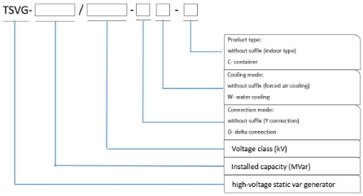

The model naming method of TSVG series product is as shown in Fig. 1-1. 

1 
TSVG Series High-voltage Static Var Generator User Manual 

2. **Specification and model**

Specification and model of TSVG series product are shown in Table 1-1 

to Table 1-8.  

Note:  The  type  applicable  to  high  altitude  needs  to  be  specially customized.  

Table 1-1 3kV indoor type series 
`  `(Note: See the technical agreement for specific dimensions.) 
The table describes the "3kV indoor type series" of the TSVG Series High-Voltage Static Var Generator, including the model, capacity, compensating current, cooling mode, connection mode, and dimensions.
<table><tr><th colspan="1" rowspan="2" valign="top">Model </th><th colspan="1" rowspan="2">Capacity (MVar)  </th><th colspan="1" rowspan="2">
Compensating current 

(A)  
</th><th colspan="1" rowspan="2">Cooling mode </th><th colspan="1" rowspan="2">Connection mode </th><th colspan="3">Dimensions (mm) (excluding linked reactor)</th></tr>
<tr><td colspan="1">Width W </td><td colspan="1">Depth D </td><td colspan="1">Height H </td></tr>
<tr><td colspan="1" valign="top">TSVG-01/03 </td><td colspan="1" valign="top">1  </td><td colspan="1" valign="top">193  </td><td colspan="1" valign="top">Forced air cooling </td><td colspan="1" valign="top">Y connection </td><td colspan="1" valign="top">2700  </td><td colspan="1" valign="top">1130  </td><td colspan="1" valign="top">2850  </td></tr>
<tr><td colspan="1" valign="top">TSVG-02/03 </td><td colspan="1" valign="top">2  </td><td colspan="1" valign="top">385  </td><td colspan="1" valign="top">Forced air cooling </td><td colspan="1" valign="top">Y connection </td><td colspan="1" valign="top">2700  </td><td colspan="1" valign="top">1130  </td><td colspan="1" valign="top">2850  </td></tr>
<tr><td colspan="1">TSVG-03/03 </td><td colspan="1">3  </td><td colspan="1">578  </td><td colspan="1">Forced air cooling </td><td colspan="1" valign="top">Y connection </td><td colspan="1">3400  </td><td colspan="1">1230  </td><td colspan="1">3100  </td></tr>
</table>

Table 1-2 3kV outdoor container type series 
`  `(Note: See the technical agreement for specific dimensions.) 
This table describes the specifications and dimensions of the 3kV outdoor container type series for the TSVG Series High-Voltage Static Var Generator.
<table><tr><th colspan="1" rowspan="2">Model </th><th colspan="1" rowspan="2" valign="top">Capacity (MVar)  </th><th colspan="1" rowspan="2">
Compensating current 

(A)  
</th><th colspan="1" rowspan="2" valign="top">Cooling mode </th><th colspan="1" rowspan="2" valign="top">Connection mode </th><th colspan="3">Dimensions (mm) (excluding linked reactor) </th></tr>
<tr><td colspan="1">Width (W) </td><td colspan="1">Depth (D) </td><td colspan="1">Height (H) </td></tr>
<tr><td colspan="1">TSVG-01/03-C </td><td colspan="1">1  </td><td colspan="1">193  </td><td colspan="1">Forced air cooling </td><td colspan="1">Y connection </td><td colspan="1">3300 </td><td colspan="1">2438 </td><td colspan="1">3200 </td></tr>
<tr><td colspan="1">TSVG-02/03-C </td><td colspan="1">2  </td><td colspan="1">385  </td><td colspan="1">Forced air cooling </td><td colspan="1">Y connection </td><td colspan="1">3300 </td><td colspan="1">2438 </td><td colspan="1">3200 </td></tr>
<tr><td colspan="1">TSVG-03/03-C </td><td colspan="1">3  </td><td colspan="1">578  </td><td colspan="1">Forced air cooling </td><td colspan="1">Y connection </td><td colspan="1">6058 </td><td colspan="1">2438 </td><td colspan="1">3200 </td></tr>
</table>

Table 1-3 6kV indoor type series 
`  `(Note: See the technical agreement for specific dimensions.) 
The table describes the "TSVG Series High-Voltage Static Var Generator" and provides information about its various models, capacities, compensating current, cooling mode, connection mode, and dimensions.
<table><tr><th colspan="1" rowspan="2">Model</th><th colspan="1" rowspan="2" valign="top">Capacity (MVar)  </th><th colspan="1" rowspan="2">
Compensating current 

(A)  
</th><th colspan="1" rowspan="2" valign="top">Cooling mode</th><th colspan="1" rowspan="2" valign="top">Connection mode </th><th colspan="3">Dimensions (mm) (excluding linked reactor)</th></tr>
<tr><td colspan="1">Width (W) </td><td colspan="1">Depth (D) </td><td colspan="1">Height (H) </td></tr>
<tr><td colspan="1" valign="top">TSVG-01/06</td><td colspan="1" valign="top">1  </td><td colspan="1" valign="top">97 </td><td colspan="1" valign="bottom">Forced air cooling </td><td colspan="1" valign="top">Y connection </td><td colspan="1" valign="top">3900  </td><td colspan="1" valign="top">1130  </td><td colspan="1" valign="top">2850  </td></tr>
<tr><td colspan="1">TSVG-02/06</td><td colspan="1">2  </td><td colspan="1">193 </td><td colspan="1" valign="bottom">Forced air cooling </td><td colspan="1">Y connection </td><td colspan="1">3900  </td><td colspan="1">1130  </td><td colspan="1">2850  </td></tr>
<tr><td colspan="1">TSVG-03/06</td><td colspan="1">3  </td><td colspan="1">289 </td><td colspan="1" valign="bottom">Forced air cooling </td><td colspan="1">Y connection </td><td colspan="1">3900  </td><td colspan="1">1130  </td><td colspan="1">2850  </td></tr>
<tr><td colspan="1">TSVG-04/06</td><td colspan="1">4  </td><td colspan="1">385 </td><td colspan="1" valign="bottom">Forced air cooling </td><td colspan="1">Y connection </td><td colspan="1">3900  </td><td colspan="1">1130  </td><td colspan="1">2850  </td></tr>
<tr><td colspan="1">TSVG-05/06</td><td colspan="1">5  </td><td colspan="1">481 </td><td colspan="1" valign="bottom">Forced air cooling </td><td colspan="1">Y connection </td><td colspan="1">5300  </td><td colspan="1">1230  </td><td colspan="1">3100  </td></tr>
<tr><td colspan="1">TSVG-06/06</td><td colspan="1">6  </td><td colspan="1">577 </td><td colspan="1" valign="bottom">Forced air cooling </td><td colspan="1">Y connection </td><td colspan="1">5300  </td><td colspan="1">1230  </td><td colspan="1">3100  </td></tr>
<tr><td colspan="1">TSVG-07/06</td><td colspan="1">7  </td><td colspan="1">673 </td><td colspan="1">Forced air cooling </td><td colspan="1">Y connection </td><td colspan="1">5300  </td><td colspan="1">1230  </td><td colspan="1">3100  </td></tr>
</table>

Table 1-4 6kV outdoor container type series 
`  `(Note: See the technical agreement for specific dimensions.) 
This table describes the models, capacity, compensating current, cooling mode, connection mode, and dimensions of the 6kV outdoor container type series for the TSVG Series High-Voltage Static Var Generator.
<table><tr><th colspan="1" rowspan="2">Model</th><th colspan="1" rowspan="2">Capacity (MVar) </th><th colspan="1" rowspan="2">
Compensating current 

(A) 
</th><th colspan="1" rowspan="2">Cooling mode</th><th colspan="1" rowspan="2">Connection mode</th><th colspan="3">Dimensions (mm) (excluding linked reactor)</th></tr>
<tr><td colspan="1">Width (W) </td><td colspan="1">Depth (D) </td><td colspan="1">Height (H) </td></tr>
<tr><td colspan="1">TSVG-01/06-C</td><td colspan="1">1  </td><td colspan="1">97 </td><td colspan="1">Forced air cooling </td><td colspan="1">Y connection </td><td colspan="1">6058 </td><td colspan="1">2438 </td><td colspan="1">2896 </td></tr>
<tr><td colspan="1">TSVG-02/06-C</td><td colspan="1">2  </td><td colspan="1">193 </td><td colspan="1">Forced air cooling </td><td colspan="1">Y connection </td><td colspan="1">6058 </td><td colspan="1">2438 </td><td colspan="1">2896 </td></tr>
<tr><td colspan="1">TSVG-03/06-C</td><td colspan="1">3  </td><td colspan="1">289 </td><td colspan="1">Forced air cooling </td><td colspan="1">Y connection </td><td colspan="1">6058 </td><td colspan="1">2438 </td><td colspan="1">2896 </td></tr>
<tr><td colspan="1">TSVG-04/06-C</td><td colspan="1">4  </td><td colspan="1">385 </td><td colspan="1">Forced air cooling </td><td colspan="1">Y connection </td><td colspan="1">6058 </td><td colspan="1">2438 </td><td colspan="1">2896 </td></tr>
</table>

|TSVG-05/06-C|5  |481 |Forced air cooling |Y connection |9125 |2438 |2896 |
| - | - | - | -: | - | - | - | - |
|TSVG-06/06-C|6  |577 |Forced air cooling |Y connection |9125 |2438 |2896 |
|TSVG-07/06-C|7  |673 |Forced air cooling |Y connection |9125 |2438 |2896 |

Table 1-5 10kV indoor type series 
`  `(Note: See the technical agreement for specific dimensions.) 
The table describes the specifications and dimensions of the TSVG Series High-Voltage Static Var Generator models.
<table><tr><th colspan="1" rowspan="2" valign="top">Model</th><th colspan="1" rowspan="2">Capacity (MVar)  </th><th colspan="1" rowspan="2" valign="top">
Compensating current 

(A)  
</th><th colspan="1" rowspan="2">Cooling mode</th><th colspan="1" rowspan="2">Connection mode</th><th colspan="3">Dimensions (mm) (excluding linked reactor)</th></tr>
<tr><td colspan="1">Width (W) </td><td colspan="1">Depth (D) </td><td colspan="1">Height (H) </td></tr>
<tr><td colspan="1" valign="top">TSVG- 01/10  </td><td colspan="1" valign="top">1  </td><td colspan="1" valign="top">58  </td><td colspan="1" valign="top">Forced air cooling </td><td colspan="1" valign="top">Y connection </td><td colspan="1" valign="top">5100  </td><td colspan="1" valign="top">1130  </td><td colspan="1" valign="top">2850  </td></tr>
<tr><td colspan="1" valign="top">TSVG- 02/10  </td><td colspan="1" valign="top">2  </td><td colspan="1" valign="top">115  </td><td colspan="1" valign="top">Forced air cooling </td><td colspan="1" valign="top">Y connection </td><td colspan="1" valign="top">5100  </td><td colspan="1" valign="top">1130  </td><td colspan="1" valign="top">2850  </td></tr>
<tr><td colspan="1" valign="top">TSVG- 03/10  </td><td colspan="1" valign="top">3  </td><td colspan="1" valign="top">173  </td><td colspan="1" valign="top">Forced air cooling </td><td colspan="1" valign="top">Y connection </td><td colspan="1" valign="top">5100  </td><td colspan="1" valign="top">1130  </td><td colspan="1" valign="top">2850  </td></tr>
<tr><td colspan="1" valign="top">TSVG- 04/10  </td><td colspan="1" valign="top">4  </td><td colspan="1" valign="top">231  </td><td colspan="1" valign="top">Forced air cooling </td><td colspan="1" valign="top">Y connection </td><td colspan="1" valign="top">5100  </td><td colspan="1" valign="top">1130  </td><td colspan="1" valign="top">2850  </td></tr>
<tr><td colspan="1" valign="top">TSVG- 05/10  </td><td colspan="1" valign="top">5  </td><td colspan="1" valign="top">289  </td><td colspan="1" valign="top">Forced air cooling </td><td colspan="1" valign="top">Y connection </td><td colspan="1" valign="top">5100  </td><td colspan="1" valign="top">1130  </td><td colspan="1" valign="top">2850  </td></tr>
<tr><td colspan="1" valign="top">TSVG- 06/10  </td><td colspan="1" valign="top">6  </td><td colspan="1" valign="top">346  </td><td colspan="1" valign="top">Forced air cooling </td><td colspan="1" valign="top">Y connection </td><td colspan="1" valign="top">5100  </td><td colspan="1" valign="top">1130  </td><td colspan="1" valign="top">2850  </td></tr>
<tr><td colspan="1" valign="top">TSVG- 08/10  </td><td colspan="1">8  </td><td colspan="1">462  </td><td colspan="1" valign="top">Forced air cooling </td><td colspan="1" valign="top">Y connection </td><td colspan="1">5100 </td><td colspan="1">1230  </td><td colspan="1">3100  </td></tr>
<tr><td colspan="1" valign="top">TSVG- 10/10  </td><td colspan="1" valign="top">10  </td><td colspan="1" valign="top">577  </td><td colspan="1" valign="top">Forced air cooling </td><td colspan="1" valign="top">Y connection </td><td colspan="1" valign="top">7200  </td><td colspan="1" valign="top">1230  </td><td colspan="1" valign="top">3100  </td></tr>
<tr><td colspan="1">TSVG- 12/10  </td><td colspan="1" valign="top">12  </td><td colspan="1" valign="top">692  </td><td colspan="1" valign="top">Forced air cooling </td><td colspan="1">Y connection </td><td colspan="1" valign="top">7200  </td><td colspan="1" valign="top">1230  </td><td colspan="1" valign="top">3100  </td></tr>
</table>

Table 1-6 10kV outdoor container type series 
`  `(Note: See the technical agreement for specific dimensions.) 
The table describes the "TSVG Series High-Voltage Static Var Generator" and provides information about its different models, capacities, compensating current, cooling mode, connection mode, and dimensions.
<table><tr><th colspan="1" rowspan="2">Model</th><th colspan="1" rowspan="2">Capacity (MVar) </th><th colspan="1" rowspan="2">
Compensating current 

(A) 
</th><th colspan="1" rowspan="2">Cooling mode</th><th colspan="1" rowspan="2">Connection mode</th><th colspan="3">Dimensions (mm) (excluding linked reactor)</th></tr>
<tr><td colspan="1">Width (W) </td><td colspan="1">Depth (D) </td><td colspan="1">Height (H) </td></tr>
<tr><td colspan="1">TSVG- 01/10-C </td><td colspan="1">1  </td><td colspan="1">58  </td><td colspan="1">Forced air cooling </td><td colspan="1">Y connection </td><td colspan="1">9125 </td><td colspan="1">2438 </td><td colspan="1">2896 </td></tr>
<tr><td colspan="1">TSVG- 02/10-C </td><td colspan="1">2  </td><td colspan="1">115  </td><td colspan="1">Forced air cooling </td><td colspan="1">Y connection </td><td colspan="1">9125 </td><td colspan="1">2438 </td><td colspan="1">2896 </td></tr>
<tr><td colspan="1">TSVG- 03/10-C </td><td colspan="1">3  </td><td colspan="1">173  </td><td colspan="1">Forced air cooling </td><td colspan="1">Y connection </td><td colspan="1">9125 </td><td colspan="1">2438 </td><td colspan="1">2896 </td></tr>
<tr><td colspan="1">TSVG- 04/10-C </td><td colspan="1">4  </td><td colspan="1">231  </td><td colspan="1">Forced air cooling </td><td colspan="1">Y connection </td><td colspan="1">9125 </td><td colspan="1">2438 </td><td colspan="1">2896 </td></tr>
<tr><td colspan="1">TSVG- 05/10-C </td><td colspan="1">5  </td><td colspan="1">289  </td><td colspan="1">Forced air cooling </td><td colspan="1">Y connection </td><td colspan="1">9125 </td><td colspan="1">2438 </td><td colspan="1">2896 </td></tr>
<tr><td colspan="1">TSVG- 06/10-C </td><td colspan="1">6  </td><td colspan="1">346  </td><td colspan="1">Forced air cooling </td><td colspan="1">Y connection </td><td colspan="1">9125 </td><td colspan="1">2438 </td><td colspan="1">2896 </td></tr>
<tr><td colspan="1">TSVG- 08/10-C </td><td colspan="1">8  </td><td colspan="1">462  </td><td colspan="1">Forced air cooling </td><td colspan="1">Y connection </td><td colspan="1">9125 </td><td colspan="1">2438 </td><td colspan="1">2896 </td></tr>
<tr><td colspan="1">TSVG- 10/10-C </td><td colspan="1">10  </td><td colspan="1">577  </td><td colspan="1">Forced air cooling </td><td colspan="1">Y connection </td><td colspan="1">12192 </td><td colspan="1">2438 </td><td colspan="1">2896 </td></tr>
<tr><td colspan="1">TSVG- 12/10-C </td><td colspan="1">12  </td><td colspan="1">692  </td><td colspan="1">Forced air cooling </td><td colspan="1">Y connection </td><td colspan="1">12192 </td><td colspan="1">2438 </td><td colspan="1">2896 </td></tr>
</table>

5 

TSVG Series High-voltage S

Table 1-7 35kV indoor direct-mount type series           (Note: See the technical agreement for specific dimensions.) 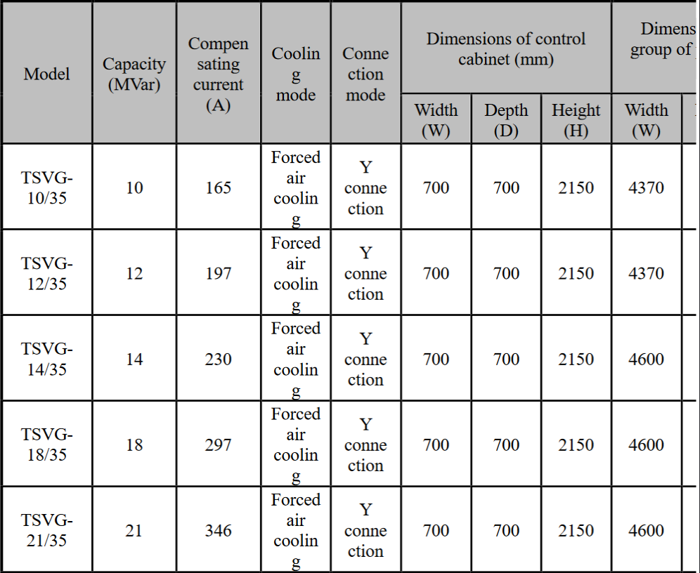
TSVG Series High-voltage S
|TSVG- 28/35  |28  |462  |
Forced air 

coolin

g 
|Y conne ction |700  |700  |2150  |4600  |
| - | - | - | :-: | :- | - | - | - | - |
|TSVG- 30/35  |30 |497  |
Forced air 

coolin

g 
|Y conne ction |700  |700  |2150  |4600  |
|TSVG- 35/35  |35  |577  |
Forced air 

coolin

g 
|Y conne ction |700  |700  |2150  |4600  |
|TSVG- 42/35  |42  |693  |
Forced air 

coolin

g 
|Y conne ction |700  |700  |2150  |4600  |

9 
TSVG Series High-voltage Static Var Generator User Manual ![ref3]

Table 1-8 35kV outdoor container type series  
(Note: See the technical agreement for specific dimensions.) 
The table describes the TSVG Series High-voltage Static Var Generator models and their specifications.
<table><tr><th colspan="1" rowspan="2">Model</th><th colspan="1" rowspan="2">Capacit y (MVar) </th><th colspan="1" rowspan="2">
Comp ensati ng curren t 

(A) 
</th><th colspan="1" rowspan="2">Cooli ng mode</th><th colspan="1" rowspan="2">Conne ction mode</th><th colspan="1" rowspan="2">Qty. of container s</th><th colspan="3">Dimensions of a single container</th></tr>
<tr><td colspan="1">Width (W) </td><td colspan="1">Depth (D) </td><td colspan="1">Heigh t (H) </td></tr>
<tr><td colspan="1" valign="top">TSVG- 10/35-C  </td><td colspan="1" valign="top">10  </td><td colspan="1" valign="top">165  </td><td colspan="1" valign="top">
Force d air coolin

g 
</td><td colspan="1" valign="top">Y conne ction </td><td colspan="1" valign="top">1/set </td><td colspan="1" valign="top">16000 </td><td colspan="1" valign="top">2438 </td><td colspan="1" valign="top">2896 </td></tr>
<tr><td colspan="1">TSVG- 12/35-C  </td><td colspan="1" valign="top">12  </td><td colspan="1" valign="top">197  </td><td colspan="1">
Force d air coolin

g 
</td><td colspan="1" valign="top">Y conne ction </td><td colspan="1" valign="top">1/set </td><td colspan="1" valign="top">16000 </td><td colspan="1" valign="top">2438 </td><td colspan="1" valign="top">2896 </td></tr>
<tr><td colspan="1" valign="top">TSVG- 14/35-C  </td><td colspan="1" valign="top">14  </td><td colspan="1" valign="top">230  </td><td colspan="1" valign="top">
Force d air coolin

g 
</td><td colspan="1" valign="top">Y conne ction </td><td colspan="1" valign="top">1/set </td><td colspan="1" valign="top">16000 </td><td colspan="1" valign="top">2438 </td><td colspan="1" valign="top">2896 </td></tr>
<tr><td colspan="1" valign="top">TSVG- 18/35-C  </td><td colspan="1" valign="top">18  </td><td colspan="1" valign="top">297  </td><td colspan="1" valign="top">
Force d air coolin

g 
</td><td colspan="1" valign="top">Y conne ction </td><td colspan="1" valign="top">1/set </td><td colspan="1" valign="top">16000 </td><td colspan="1" valign="top">2438 </td><td colspan="1" valign="top">2896 </td></tr>
<tr><td colspan="1" valign="top">TSVG- 21/35-C </td><td colspan="1" valign="top">21  </td><td colspan="1" valign="top">346  </td><td colspan="1" valign="top">
Force d air coolin

g 
</td><td colspan="1" valign="top">Y conne ction </td><td colspan="1" valign="top">1/set </td><td colspan="1" valign="top">16000 </td><td colspan="1" valign="top">2438 </td><td colspan="1" valign="top">2896 </td></tr>
<tr><td colspan="1">TSVG- 28/35-C  </td><td colspan="1" valign="top">28  </td><td colspan="1" valign="top">462  </td><td colspan="1" valign="top">
Force d air coolin

g 
</td><td colspan="1" valign="top">Y conne ction </td><td colspan="1" valign="top">2/set </td><td colspan="1" valign="top">12192 </td><td colspan="1" valign="top">2438 </td><td colspan="1" valign="top">2896 </td></tr>
<tr><td colspan="1">TSVG- 30/35-C </td><td colspan="1" valign="top">30 </td><td colspan="1" valign="top">497  </td><td colspan="1">
Force d air coolin

g 
</td><td colspan="1" valign="top">Y conne ction </td><td colspan="1" valign="top">2/set </td><td colspan="1" valign="top">12192 </td><td colspan="1" valign="top">2750 </td><td colspan="1" valign="top">2896 </td></tr>
<tr><td colspan="1" valign="top">TSVG- 35/35-C  </td><td colspan="1">35  </td><td colspan="1">577  </td><td colspan="1" valign="top">
Force d air coolin

g 
</td><td colspan="1" valign="top">Y conne ction </td><td colspan="1">2/set </td><td colspan="1">12192 </td><td colspan="1">2750 </td><td colspan="1">2896 </td></tr>
<tr><td colspan="1" valign="top">TSVG- 42/35-C  </td><td colspan="1">42  </td><td colspan="1">693  </td><td colspan="1" valign="top">
Force d air coolin

g 
</td><td colspan="1">Y conne ction </td><td colspan="1">2/set </td><td colspan="1">12192 </td><td colspan="1">2750 </td><td colspan="1">2896 </td></tr>
</table>

3. **Exterior and system composition**

**1.3.1 System composition** 

TSVG series high-voltage static var generator is mainly composed of 5 parts,  i.e.  starting  cabinet,  control  cabinet,  power  cabinet,  linked  reactor  (or bypass transformer) and cooling device.  

1) **Starting cabinet** 

Starting cabinet consists of starting switch, starting resistor and lightning arrester.  

TSVG series high-voltage static var generator adopts self-excitation startup. After the main switch is closed, the DC capacitor of power unit will be started through starting resistor at system voltage; when the starting voltage reaches 80% of the rated value, the control system will close the starting switch and start the resistor bypass. 

2) **Control cabinet** 

Control cabinet consists of controller, touch screen, control power supply, relay and air switch.  

Control power supply includes four switch power supplies, i.e. two DC24V power supplies (supplying power for operation of touch screen and relay in redundancy  mode)  and  two  DC12V  power  supplies  (supplying  power  for controller  case  in  redundancy  mode).  Main  control  panel  consists  of  power supply, operation and fault lights, touch screen and emergency stop button. 

Start, stop, reset and local and remote control can be realized through touch 

screen. For specific functions, see Chapter III. 

3) **Power cabinet** 

The main component of power cabinet is power module (also called link).  

The  3kV  power  cabinet  includes  a  three-phase  system  consisting  of  12 power  modules,  every  4  modules  at  each  phase  in  cascade  connection successively;  the  6kV  includes  a  three-phase  system  consisting  of  24  power modules, every 8 modules at each phase in cascade connection successively; the 10kV  power  cabinet  includes  a  three-phase  system  consisting  of  36  power modules, every 12 modules at each phase in cascade connection successively.  

 

Fig. 1-3 Layout of indoor type power cabinet     Fig. 1-4 Diagram of outdoor cabinet  

4) **Linked reactor (or bypass transformer)** 

The output of device is connected in parallel with the system side through linked reactor or bypass transformer.  

5) **Cooling device** 

Forced air cooling system consists of cooling fan and control circuit, which have been included in the power cabinet and the control cabinet.  

4. **Basic principle of the system**

The elementary wiring diagram of TSVG is as shown in Fig. 1-5, where 

self-commutation voltage source converter is connected in parallel to the power 

grid via transformer or reactor, and through adjustment of the amplitude and phase  of  output  voltage  at  the  AC  side  of  the  voltage  source  converter,  the converter  can  output  continuously  varying  capacitive  or  inductive  reactive current, thus realizing the purpose of reactive compensation. The relation of output  current,  output  voltage  and  system  voltage  of  TSVG  at  no-load, capacitive and inductive operation modes is as shown in Table 1-10: 

*IL*

SVG Sys  tem 

De  vi  ce   volUtage U*IL*System   vol  ta  geU US S Fig. 1-5 Schematic diagram of TSVG 

Table 1-10 Basic principles of TSVG 

|Opera tion mode |Waveform and phasor diagram |Remarks |
| :- | - | - |
|No-lo ad operat ion |No current |In this case, IL=0.  |

|Capac itive operat ion |
Leading 

current 
|If Us<Uc, IL is leading current. The amplitude of this current can be continuously controlled through adjustment of Uc; SVG plays a role of adjustable capacitor and its capacitive reactance can be continuously controlled.  |
| :- | - | :- |
|Induct ive operat ion |
Lagging 

current 
|If Us>Uc, IL is lagging current. SVG plays a role of adjustable reactor and its inductive reactance can be continuously controlled.  |

5. **Main technical specifications**

Table 1-11 Main technical specifications of TSVG 
|Rated operating voltage |3kV/6kV/10kV/35kV |
| - | - |
|Range of operating voltage (p.u.) |0\.4~1.2 p.u. |
|Rated capacity |1~42MVar |
|Range of output reactive power |Continuously varying from rated capacitive reactive power to inductive reactive power |
|Response time of controller |<5ms |
|Total harmonic distortion rate of output current |<2.5% |
|Voltage fluctuation |≤2% |
|Efficiency of converter chain |>99.2% |
|Human-machine interface |Operation interface with Chinese display to be adopted |
|Communication mode |485 communication signals: twisted shielded pair Ethernet communication interface |

6. **Environmental requirements**
1. **Operating environment** 

For operating environment, refer to standards IEC61800-4; see Table 1-12 below for details.  

Table 1-12 Requirements on operating environment 
|Items|Requirements|
| - | - |
|Ambient temperature|-25°C~+45°C, to be derated for use at above 45°C|
|Relative humidity|≤90%, without condensation|
|Atmospheric pressure|86kPa~106kPa |
|Altitude|Up to 2km; to be derated for use at above 2km; to be specially customized for use at above 3km|

2. **Storage environment** 

For storage environment, refer to standards IEC61800 and; see Table 1-13 below for details.  

Table 1-13 Requirements on storage environment 
|Items|Requirements|
| - | - |
|Ambient temperature|-40°C ~70°C |
|Relative humidity|≤90%, without condensation|
|Seismic intensity|7 degrees|
|Storage time|Delivery and storage time not exceeding 6 months|

**Chapter II Transportation and Installation**

Proper transportation, emplacement and installation are crucial for normal and safe operation of the TSVG series high-voltage static var generator.  

1. **Precautions for transportation**

TSVG series high-voltage static var generator can be transported by truck, 

train, ship and other means of transportation. During transportation, the product must be handled carefully and prevented from exposure to rain or sun, strenuous vibration,  impact  and  upside-down  placement.  Packing  containers  shall  be stacked in an orderly, compact, safe and reliable way to prevent damage caused by  shake  during  transportation.  In  consideration  of  complicated  conditions during transportation, rainproof measures must be taken to ensure the safety of goods. Covering cloth, when used for rain proofing of pickup truck, shall be securely bound and the vehicle door shall be tightly closed during travel to prevent any cargo being thrown out. 

1) Before  transportation,  an  investigation  shall  be  made  for  the  road 

conditions, including the driving path, the height, width, and bearing capacity of bridges and culverts, and the conditions of traffic signaling facilities along the way;  

2) Personnel  shall  be  arranged  in  advance  for  site  preparation  and 

formation, the path for cranes and trucks to enter the site shall be leveled up and compacted, and surface regolith at the pivot point of crane shall be cleaned up and sleeper shall be cushioned;  

3) Before truck loading, inspection shall be made again to see whether the 

conditions  and  fuel  of  vehicles  for  transportation  and  lifting  meet  the requirements. Weather conditions shall be confirmed and transportation shall not be allowed in case of inclement weather; 

4) The  product  shall  be  transported  in  the  driving  route  confirmed  in 

advance and at a speed not exceeding the maximum allowable value.  

2. **Precautions for installation**
1. **Requirements on installation environment** 

To  ensure  long-term  stable  and  reliable  operation  of  TSVG  series high-voltage static var generator, the following requirements are proposed on the installation and service environment: 

1) The product shall be installed in an environment free from corrosive gas, 

combustible gas, conductive dust, water drips, salt mist and oil smoke;  

2) The ambient temperature shall fall within -25°C ~+45°C; if the ambient 

temperature exceeds the allowable value, safe and reliable ventilation or heat 

dissipation device shall be provided;  

3) Measures shall be taken to prevent damage caused by grounded short 

circuit due to invasion of snake, rat or any other animal.  

2. **Mechanical installation requirements** 

TSVG series high-voltage static var generator shall be installed in strict compliance with the installation drawing. All cabinets or containers shall be securely installed on the channel steel base and reliably connected to the ground. 

The incoming line shield and grounding terminal of transformer shall also be connected to the ground and cabinets shall be interconnected as a whole. 

During installation, attention shall be paid to the following matters: 

1) Cabinet or container shall be protected from intense shaking during 

installation;  

2) Cabinet or container shall be transferred slowly with a cart and attention 

shall be paid to the traveling direction of the cart to prevent inclination; 

3) Care  shall  be  taken  during  handling  and  installation  of  cabinet  or 

container so as not to crush hand, foot or equipment cabinet or container;  

4) Steel plate shall be cushioned with paperboard or any other soft object 

at the end indoor to prevent damage to indoor ground due to heavy bump;  

5) Tilting prevention measure shall be taken before cabinet or container is 

securely fixed.  

3. **Electrical installation requirements** 

Before  wiring,  the  sectional  area  and  voltage  class  of  wires  shall  be confirmed to meet requirements. Transformer and input and output HV cables must be subjected to voltage withstand test and the power unit shall not be switched in during test. 

During  installation,  the  cabinet  of  TSVG  series  high-voltage  static  var generator shall be kept reliably connected to ground so as to ensure personal safety.  

1) Input and output cables must be wired separately to prevent wrong 

connection and insulation damage;  

2) Long-distance parallel wiring shall not be adopted for signal line and 

power line; signal line and communication line must adopt shield cable, with the shielding layer grounded at single end;  

3) Controller shall be provided with specialized grounding electrode with 

grounding resistance not greater than 1Ω; 

4) Wires and electrical elements shall be securely and reliably connected 

with bolts or plug-ins or through welding or compression splice;  

5) Wires in cabinet shall not be equipped with joint and wire core shall be 

free from damage;  

6) The end of cable cores and the corresponding wires shall be marked 

with correct and clear circuit number which shall be not easy to fade; 

7) Wiring shall be orderly, clear and artistic and wire insulation shall be 

kept in good condition and free from damage;  

8) Cables led to the cabinet shall be neatly arranged, clearly numbered and 

securely fixed without crossover, and the terminal block shall not be subjected to mechanical stress;  

9) High and low voltage circuits shall not share the same cable, and shall 

be arranged in bunches separately and in case of any difficult, provided with high-insulation separator;  

10) Good  illumination  shall  be  guaranteed  for  enclosed  cabinet  with 

lighting;  

11) Terminal  size  shall  match  with  the  sectional  area  of  wires,  small 

terminal for large sectional area of wire is not allowed;  

12) AC signal line and DC signal line shall be routed separately.  

**For  detailed  installation  specifications,  see  the  technical  document *Instructions for Field Installation*.**  

**Chapter III Operating  Instructions  for  Operation  Panel  and Touch Screen**

1. **Operating instructions for operation panel**

The  device  can  be  operated  through  either  touch  screen  or  remote background.  The  touch  screen  is  arranged  on  the  door  panel  of  the  control cabinet and the remote background is generally located in the remote monitoring room  with  a  certain  distance  to  the  device.  Only  one  control  command  is effective at any time, either that from touch screen or remote background, and 

option can be made through the “Local/Remote” on the touch screen. 

Fig. 3-1 Front view of control cabinet 
The display control panel of control cabinet is composed of indicator light, touch screen and emergency stop button, as shown in Fig. 3-1. For detailed description of each element on the control cabinet door, see Table 3-1.  

Table 3-1 Description of elements of operation panel 
This table describes the elements of the operation panel on the control cabinet door.
<table><tr><th colspan="1"><b>Item</b></th><th colspan="1"><b>Description</b></th><th colspan="1"><b>Function</b></th></tr>
<tr><td colspan="1" rowspan="3">Indicator light</td><td colspan="1">Power light</td><td colspan="1">When the light is on, it indicates that AC380V and DC220V power supplies of control cabinet are at normal state.  </td></tr>
<tr><td colspan="1">Running light</td><td colspan="1">When the light is on, it indicates the device is connected to grid; when the light is off, it indicates the device quits running. </td></tr>
<tr><td colspan="1">Fault light</td><td colspan="1">When the light is on, it indicates a serious fault occurring before grid connection or a fault leading to tripping after grid connection. </td></tr>
<tr><td colspan="1">Touch screen</td><td colspan="1">Human-machine interface</td><td colspan="1">When operating the device in the local control room, the user can carry out operations including status monitoring, parameter setting, operation control, and fault inquiry through touch screen without a keyboard. </td></tr>
<tr><td colspan="1">Button</td><td colspan="1">Emergency stop button</td><td colspan="1">The button can be used to stop the device in case of emergency. </td></tr>
</table>

2. **Operating instructions for touch screen**
1. **Backlight** 

When there is no operation on the touch screen for a certain period of time (10  minutes),  the  backlight  of  touch  screen  will  be  turned  off  and  can  be 

activated again simply by a click on the screen.  

2. **Touch screen** 

Touch screen is mainly composed of a LED indicator light and a LCD display area which is divided into three parts, i.e. B, C and D. LED indicator light indicates the current working state of the touch screen. A click on any item 

in the navigation bar of Area C of the LCD display area may enable switchover to the corresponding display interface and realize viewing and setting of relevant data and information, as shown in Fig. 3-2. 

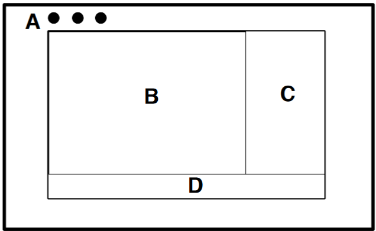
Fig. 3-2 Composition of touch screen 
For specific description of each area shown in Fig. 3-2, see Table 3-2:  

Table 3-2 Description of each area of touch screen 
|**No.**|**Description** |
| - | - |
|A |LED indicator light area |
|B |Data display area |
|C |Page navigation area |
|D |Status display area |

3. **Menu structure** 

This section mainly introduces the display interface of touch screen and the steps of parameter setting. The touch screen interface enables the user to carry out real-time data monitoring and setting of system parameters. Fig. 3-3 shows the overall menu frame of touch screen display interface.  

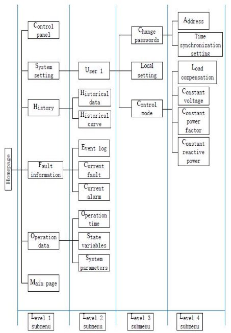
Fig. 3-3 Menu frame 
24 
TSVG Series High-voltage Static Var Generator User Manual

4. **Parameter display** 

|Interface display||Description|
| - | :- | - |
|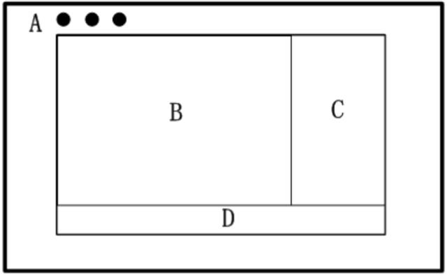||
Layout of touch screen display area: 

A: LED indicator light area

B: Data display area 

C: Page navigation area 

D: Status display area
|
||||
|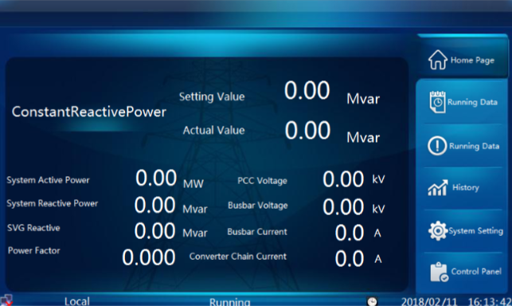||**Main page:** In default, main page will appear when touch screen is powered on. The main page displays the current control mode and control objective, main operating parameters of SVG, etc. |
||||
|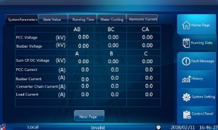||
**Operating data:** including 3 parts, i.e. “System parameters”, “State variables” and “Operation time”. A click at the subnav on the upper side of the main page enables page switching. 

**System parameters:** mainly displaying parameters of SVG and power grid such as voltage and current. A click at “Page Down” or “Page Up” enables page switching. 
|

TSVG Series High-voltage Static Var Generator User Manual 
|
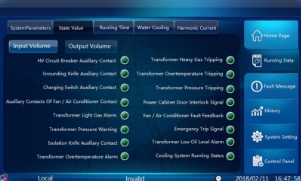

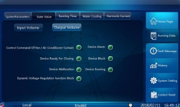

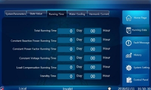
|
**State variables (input):** mainly displaying the states of circuit breaker, contactor and fan and the protection signals of transformer.  

**State variables (output):** mainly displaying the device state of SVG, control command of fan, etc.  

**Operation time:** recording the total operation time, the time of operation at each mode and the standby time.  
|
| - | :- |

||||
| :- | :- | :- |
|
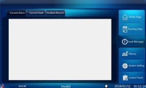
||
**Fault information:** including three parts, i.e. “Current alarm”, “Current fault” and “Event log”, switched through the subnav on the upper side.|
|
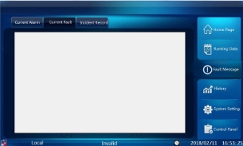
|| **Current alarm:** displaying the information of current alarm and lockout and not displaying the information of eliminated alarm or lockout.  

**Current fault:** displaying current fault and not displaying eliminated fault.  

|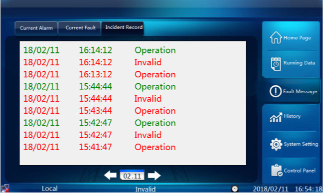||
**Event log:** storing event log in the latest 20 years and each time ||displaying the event log of a day. In default, the event log of that day is displayed on entry page. 

`    `A click at the calendar on the lower side of the page enables date switch.  

`   `A click at the arrow on either the left or the right side of the calendar enables page 

turning.  
|
||||

|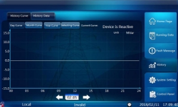 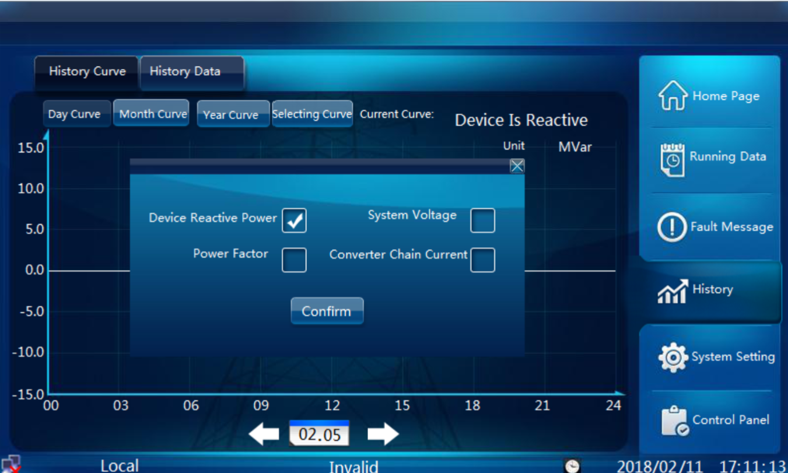 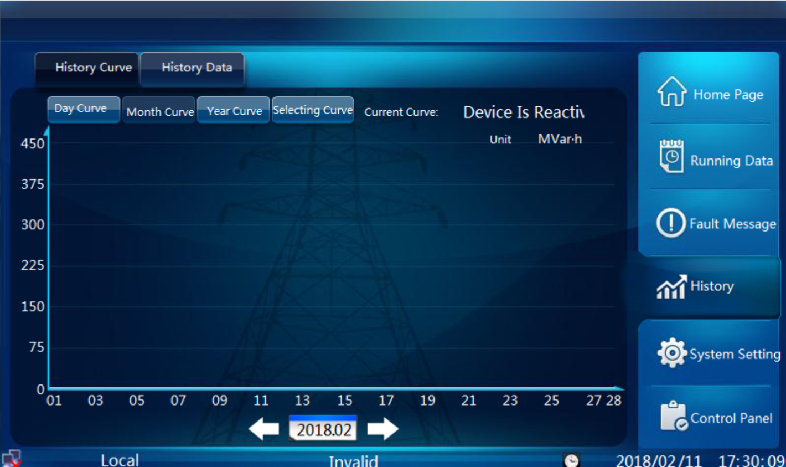 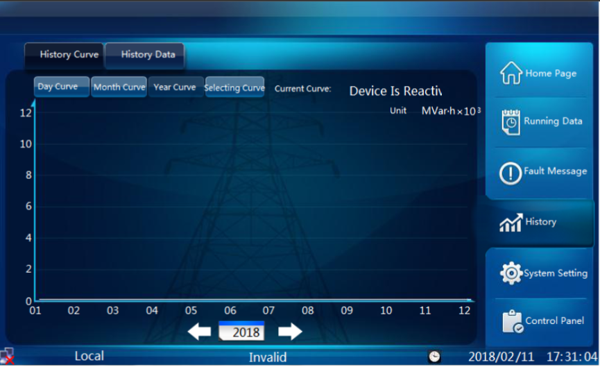||
**History:** including two parts, i.e. “Historical curve” and “Historical data” switched through subnav. 

**Historical curve:** including “Daily curve”, “Monthly curve”, “Yearly curve” and “Curve selection”.  

In default, daily/monthly/yearly curve is displayed on entry page. A click at the calendar on the lower side enables date switch.    Daily curve saves a month’s data and monthly and yearly curves save 20 years’ data.  
|
| - | :- | :- |
|||
A click at the “Curve selection” button may enable switchover of curves and selection of reactive power, power factor, system voltage and SVG current.  

The monthly/yearly curves of reactive power record the cumulative reactive power generation. The monthly/yearly curves of system voltage record the average voltage. 

No monthly/yearly curve is available for power factor and 

SVG current. 
|
||||

29 

[ref1]: Aspose.Words.a6dfd08d-0e42-4d9a-a393-729bb7fea2b2.002.png
[ref2]: Aspose.Words.a6dfd08d-0e42-4d9a-a393-729bb7fea2b2.003.png
[ref3]: Aspose.Words.a6dfd08d-0e42-4d9a-a393-729bb7fea2b2.007.png

TSVG Series High-voltage Static Var Generator User Manual 
||||
| - | :- | :- |
|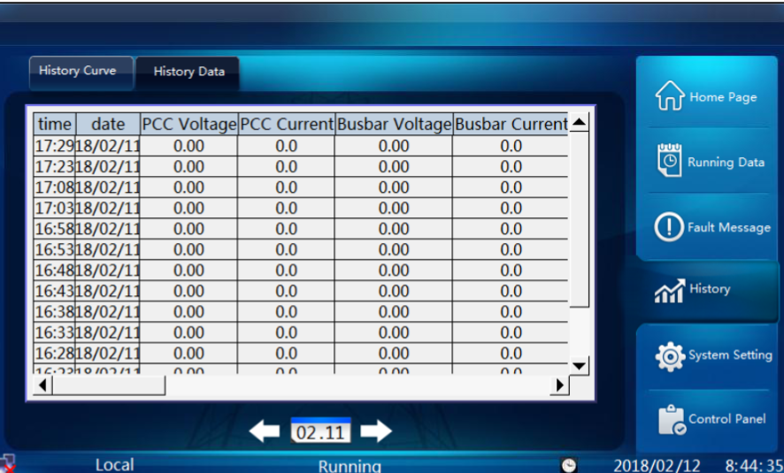||**Historical data:** recording historical data of 20 channels once every 5 minutes.  |
|||`    `Data can be saved for 20 years if the touch screen is equipped with a U disk and one month if not.  |
|||`   `In default, the data of that very day is displayed and a click at the calendar on the lower side may enable date switch.  |

5. **Parameter setting** 

|Interface display||Description|
| - | :- | - |
|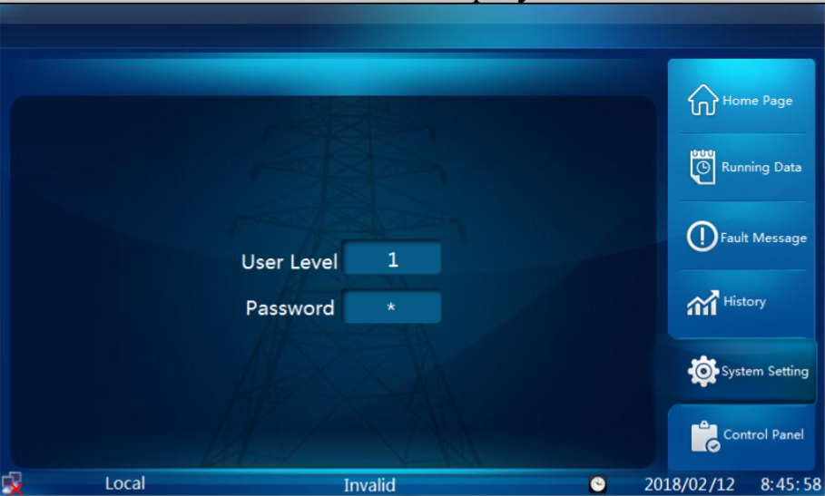||**System setting:** used by maintenance and operation personnel to set operation mode and parameters. Passwords are required to enter the system setting interface. The user level is 1 and the initial passwords are 111111. |
||||

|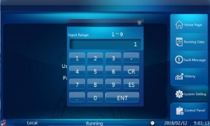|||
| - | :- | :- |
|
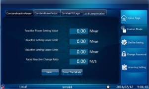

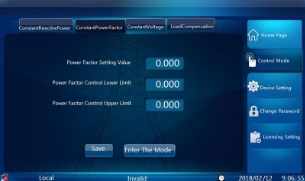
||
**Control parameter setting:** including setting of four control modes, i.e. “Constant reactive power”, “Constant power factor”, “Constant voltage” and “Load compensation”.  

**Constant reactive power:** 

In this mode, the device is able to output constant reactive power and the accuracy of reactive power tracking and step response speed of the device can be measured.  

**Constant power factor:** 

This mode is applied in the occasion where it is necessary to control the power factor of the system within a certain range. In this mode, the reactive output of the device is adjusted to stabilize the power factor of the system at the value set by the user. When the power factor of the system is lower than the lower limit set by the user, the device will output capacitive reactive power to increase power factor; when the power factor of the system is higher than the upper limit set by the user, the device will output inductive reactive power to reduce power factor.  
|

|
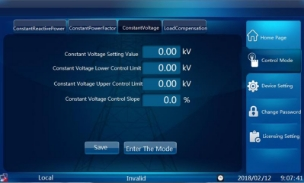

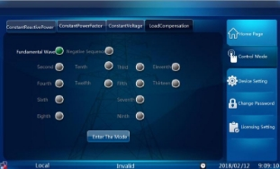

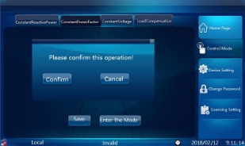
|
**Constant voltage:** 

This mode is applied in the occasion where it is necessary to stabilize the system voltage at a certain level. In this mode, the reactive output of the device is adjusted to stabilize the system voltage at the value set by the user. When the system voltage is lower than the reference value set by the user, the device will output capacitive reactive power to increase system voltage; when the system voltage is higher than such value, the device will output inductive reactive power to reduce system 

voltage. 

**Load compensation:** In this mode, the current output of the device is adjusted automatically based on the current detected at the load side to improve the power quality of the load current.  

Note 1: Operation on touch screen is forbidden when remote mode is displayed in the status bar, the same below.  

Note 2: A click at “Save parameters” will only send parameters on the page to the controller; a click at “Enter mode” will send the same to the controller and enable entry to the corresponding mode.  
|
| - | - |

|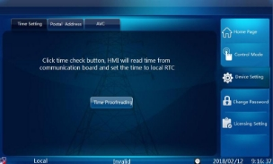 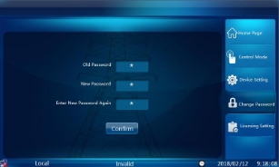||
**Time setting:** Select “Local setting” in the navigation bar and “Time setting” in the subnav bar on the upper side of the page to enter the time setting interface for time setting.  

**Address:** Select “Local setting” in the navigation bar and “Address” in the subnav bar on the upper side of the page to enter the slave address setting interface for setting of “remote MODBUS slave address” and click “Save” to send parameters.  
|
| - | :- | :- |
||||
|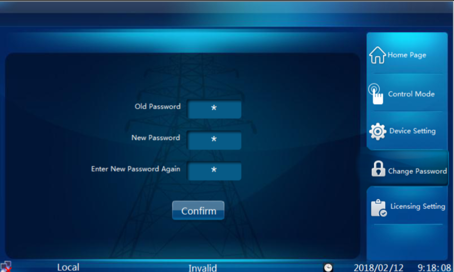||
**Change passwords:** Select “Change passwords” in the navigation bar to enter the password setting interface, input passwords in the input field of “Original passwords”, “New passwords” and “Confirm new passwords” in succession, and click “OK” to complete setting.  

Note: For level 1 user, the user level is 1 and the initial passwords are 111111 which can be changed on the menu.  
|

6. **Control panel** 

|Interface display|Description|
| - | - |
|
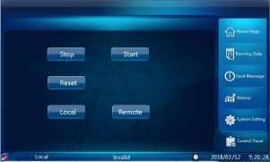

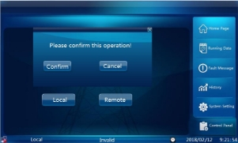
|
**Control panel:** Select “Control panel” in the navigation bar to enter the control interface, and select among “Start”, “Stop”, “Reset” and “Remote” commands for mode switchover.  

Note 1: A prompt window will pop up upon a click at the button; click “OK” for further operation.  Note 2: Operation on touch screen is forbidden when remote mode is displayed in the status bar, but the touch screen may send “Local” command at this time.   
|

**Chapter IV Instructions for Basic Operation**

1. **Preparation before power-on**
1. **Visual inspection** 
1) The exterior of the control cabinet, power cabinet and starting cabinet 

shall  be  checked  to  ensure  that  there  is  no  scratch  or  deformation  of  the enclosure of the chain-type SVG package unit;  

2) Cables shall be tightly connected without looseness;  
2) The board cards of main control case and auxiliary control case shall be 

well-equipped.  

2. **Inspection of cabinet and wiring** 
1) The fan shall be checked to ensure no visible deformation and firm 

installation; wiring shall be secure and comply with the drawing;  

2) The exterior and accessories of lightning arrestor shall be checked to 

ensure proper and secure installation; wiring shall comply with the drawing and terminal shall be free from crack;  

3) The  electric  reactor  shall  be  checked  to  ensure  well-equipped 

accessories,  intact  appearance,  firm  installation,  proper  wiring  and  tight  bolt connection;  

4) The  contactor  (circuit  breaker)  shall  be  checked  to  ensure  proper 

installation and tight bolt connection;  

5) The  starting  resistor  shall  be  checked  to  ensure  proper  and  firm 

installation, no surface crack and deviation between the resistance measured and 

that indicated on the nameplate (factory default) no greater than ± 5%;  

6) The  wiring  of  secondary  terminals  shall  be  checked  to  ensure 

compliance with drawing and orderly and firm connection;  

7) The starting cabinet shall be checked to ensure well-equipped sealing 

baffles therein;  

8) Three-phase HV incoming cables shall be checked to ensure correct 

phase sequence and firm connection.  

3. **Inspection of components of power cabinet** 
1) The power unit shall be checked to ensure proper installation and tight 

bolt connection;  

2) The connection busbar of the power unit shall be checked to ensure 

proper installation and tight bolt connection;  

3) The power cabinet shall be checked to ensure wiring therein is orderly 

and secure and complies with the drawing;  

4) The  wiring  of  secondary  terminals  shall  be  checked  to  ensure 

compliance with drawing and orderly and firm connection;  

5) The power module shall be checked to ensure correct and firm optical 

fiber connection.  

4. **Inspection of components of control cabinet** 
1) The  main  control  case  shall  be  check  to  see  whether  the  insertion 

position of board card complies with the drawing, and the quantity, model and 

serial number of the board card in the main control case shall be recorded;  

2) The auxiliary control case shall be check to see whether the insertion 

position of board card complies with the drawing ,and the quantity, model and serial number of the board card (35kV type) in the auxiliary control case shall be recorded;  

3) Each switching power supply shall be checked to ensure correct and 

firm installation and intact appearance;  

4) The status indicator light and emergency stop switch shall be checked to 

ensure proper installation;  

5) The  wiring  of  secondary  terminals  shall  be  checked  to  ensure 

compliance with drawing and orderly and firm connection.  

5. **Inspection of wiring between cabinets (and equipment)** 
1) Cable wiring from the output end of the electric reactor in the starting 

cabinet to the power cabinet shall be checked to ensure compliance with the drawing and tight bolt connection;  

2) The copper bars (cables) between power cabinet units shall be checked 

to ensure compliance with the drawing and tight bolt connection;  

3) Cable wiring of AC380V control power supply shall be checked to 

ensure compliance with the drawing and tight connection;  

4) The  wiring  from  the  terminal  block  of  the  control  cabinet  to  the 

secondary  terminal  block  of  the  starting  cabinet  shall  be  checked  to  ensure correct and firm connection and compliance with the drawing;  

5) The PT signal wiring of the control cabinet shall be checked to ensure 

correct and firm connection, compliance with the drawing and correct phase sequence;  

6) The CT signal wiring of the control cabinet shall be checked to ensure 

correct and firm connection, compliance with the drawing and correct dotted terminal;  

7) The optical fiber from the fiber optic board to the corresponding unit to 

ensure the connection is correct and firm and complies with the drawing;  

8) The wiring from the terminal block of the control cabinet to the Hall 

current transducer shall be checked to ensure correct and firm connection and 

compliance with the drawing.  

2. **Basic operations**

The user may carry out start, stop and reset operations on the control panel 

interface of the touch screen on the control cabinet of TSVG series high-voltage static var generator and select local or remote operation mode  on the touch screen.  The  user  set  the  starting  mode  as  “two-key  starting”  or  “one-key 

starting”. For specific operation, see Subsection 3.2.6. 

1. **Startup** 

Table 4-1 Startup operation procedure of TSVG device 

|**Local**|**Remote**|
| - | - |
|(1)  Ensure  cables  among  control  cabinet, power  cabinet  and  starting  cabinet  are |(1)  Ensure  cables  among  control  cabinet, power  cabinet  and  starting  cabinet  are |

|correctly  connected.  Ensure  the  SVG isolating  switch  is  closed  and  the  SVG grounding switch is open. |correctly  connected.  Ensure  the  SVG isolating  switch  is  closed  and  the  SVG grounding switch is open. |
| - | - |
|(2) Check the wiring of power supply of fan to ensure correct phase sequence and verify the rotation direction of fan agrees with that as indicated. |(2) Check the wiring of power supply of fan to ensure correct phase sequence and verify the rotation direction of fan agrees with that as indicated. |
|
(3) Close the power supply switch of control cabinet (Q1), the power supply switch of fan (Q2), the 24V power supply switch (Q4), the power  supply  switch  of  socket  (Q5),  the in-cabinet  lighting  switch  (Q6),  the  power supply  switch  of  controller  (Q7),  the  DC power supply switch (Q8), the PT detection switch  at  PCC  side  (Q9),  and  the  PT detection  switch  at  system  side  (Q10),  the panel power supply indicator light will turn on.  

In  case  of  successful  self-inspection  of control cabinet, it is allowed to close the HV circuit  breaker;  in  case  of  unsuccessful self-inspection  within  the  specified  time, self-inspection  timeout  fault  of  control 
|(3) Close the power supply switch of control cabinet (Q1), the power supply switch of fan (Q2), the 24V power supply switch (Q4), the power  supply  switch  of  socket  (Q5),  the in-cabinet  lighting  switch  (Q6),  the  power supply  switch  of  controller  (Q7),  the  DC power supply switch (Q8), the PT detection switch  at  PCC  side  (Q9),  and  the  PT detection  switch  at  system  side  (Q10).  In case of successful self-inspection of control cabinet, it is allowed to close the HV circuit breaker;  in  case  of  unsuccessful self-inspection  within  the  specified  time, self-inspection  timeout  fault  of  control cabinet shall be reported. |

|cabinet shall be reported. ||
| - | :- |
|(4) Check on the parameter panel of touch screen  to  ensure  all  parameter  settings  are correct. |(4) Check on the background parameter page to ensure all parameter settings are correct. |
|(5)  Close  the  HV  switch  through  remote operation,  and  the  SVG  status  bar  shall display  “Start”;  run  the  data  page  through touch screen to detect voltage display of each link, and the voltage at the DC side of the detected  link  shall  rise  gradually  and  get stable when reaching around 80% of the link voltage;  in  case  of  abnormal  voltage,  click the “Emergency stop” key. After successful startup  and  self-inspection  of  link,  the  soft starting switch shall be closed automatically and  the  soft  starting  resistor  shall  be bypassed; in case of no fault after SVG is maintained at standby state for 10 seconds, automatic operation shall be initiated. |(5)  Close  the  HV  switch  through  remote operation  and  run  the  data  page  through background to detect voltage display of each link, and the voltage at the DC side of the detected  link  shall  rise  gradually  and  get stable when reaching around 80% of the link voltage;  in  case  of  abnormal  voltage,  click the “Emergency stop” key. After successful startup  and  self-inspection  of  link,  the  soft starting switch shall be closed automatically and  the  soft  starting  resistor  shall  be bypassed; in case of no fault after SVG is maintained at standby state for 10 seconds, automatic operation shall be initiated. |

2. **Shutdown** 

When the HV circuit breaker is disconnected remotely or the “Emergency stop” button on the control panel is pressed down, SVG will automatically open the soft starting switch.**  

3. **Reset** 

When any fault information that can be reset appears in TSVG, reset operation can be carried out remotely through a click at the “Reset” key on the background operation panel.  

**Chapter V Fault Description and Troubleshooting** 

1. **Alarm and fault description** 

The  internal  monitoring  unit  of  TSVG  divides  all  information  into  two categories, i.e. alarm information and fault information.  

- Alarm (A) 

Alarm information refers to the information that needs the maintenance personnel’s attention and shall be handled in the following way:  

1) In case of alarm, TSVG will continue running; 
1) Alarm information will be recorded and can be inquired through touch 

screen;  

The  purpose  of  alarm  is  to  indicate  the  potential  risk  and  draw  the maintenance personnel’s attention; maintenance may be carried out at a proper time rather than immediately.  

- Fault (F) 

In case of fault, TSVG will automatically stop running and not be restarted before the fault is eliminated by the maintenance personnel. The troubleshooting method is as follows:  

1) In case of fault, the output of link will be blocked and TSVG will open 

the HV circuit breaker;  

2) The fault will be displayed on the touch screen and recorded and the 

fault light will turn on (red);  

3) Automatic reset of fault is not allowed, and when fault disappears, fault 

reset may be carried out through touch screen.  

In case of link fault leading to necessity for replacement or maintenance of the link, such replacement or maintenance shall not be carried out before the bus 

capacitor of link is fully discharged.  

2. **Troubleshooting** 

The table describes troubleshooting information for different faults in the TSVG Series High-Voltage Static Var Generator.
<table><tr><th colspan="1" valign="top">S/N </th><th colspan="1" valign="bottom">Fault sourc e </th><th colspan="1" valign="top">Description </th><th colspan="1" valign="top">Fault type </th><th colspan="1" valign="top">Possible fault causes </th><th colspan="1" valign="top">Countermeasures </th></tr>
<tr><td colspan="1" valign="top">1 </td><td colspan="1" rowspan="2" valign="top">Grid fault </td><td colspan="1" valign="bottom">Grid over-voltage alarm </td><td colspan="1" valign="top">A </td><td colspan="1" valign="bottom">Grid voltage greater than set value </td><td colspan="1" valign="top">Observe grid voltage. </td></tr>
<tr><td colspan="1" valign="top">2 </td><td colspan="1" valign="bottom">Grid over-voltage fault trip </td><td colspan="1" valign="top">F </td><td colspan="1" valign="bottom">Grid voltage greater than set value  </td><td colspan="1" valign="bottom">Check  whether  grid voltage is abnormal.  </td></tr>
<tr><td colspan="1" valign="top">3 </td><td colspan="1" rowspan="5" valign="top">Grid fault </td><td colspan="1" valign="bottom">Grid under-voltage alarm </td><td colspan="1" valign="top">A </td><td colspan="1" valign="top">Grid voltage lower than set value  </td><td colspan="1" valign="top">Observe grid voltage. </td></tr>
<tr><td colspan="1" valign="top">4 </td><td colspan="1" valign="bottom">Grid under-voltage fault trip </td><td colspan="1" valign="top">F </td><td colspan="1" valign="top">Grid voltage lower than set value </td><td colspan="1" valign="top">Check  whether  grid voltage is abnormal.  </td></tr>
<tr><td colspan="1" valign="top">5 </td><td colspan="1" valign="bottom">PT negative-phase sequence  fault trip </td><td colspan="1" valign="top">F </td><td colspan="1" valign="top">Negative-phase sequence of PT </td><td colspan="1" valign="top">Check phase sequence. </td></tr>
<tr><td colspan="1" valign="top">6 </td><td colspan="1" valign="bottom">Grid over-frequency fault trip </td><td colspan="1" valign="top">F </td><td colspan="1" valign="top">Grid  frequency  greater than set value  </td><td colspan="1" valign="top">Check  whether  grid frequency is abnormal. </td></tr>
<tr><td colspan="1" valign="top">7 </td><td colspan="1" valign="bottom">Grid under-frequency fault trip </td><td colspan="1" valign="top">F </td><td colspan="1" valign="top">Grid  frequency  lower than set value </td><td colspan="1" valign="top">Check  whether  grid frequency is abnormal. </td></tr>
<tr><td colspan="1" valign="top">8 </td><td colspan="1" valign="bottom">SVG syste m </td><td colspan="1" valign="bottom">Output over-current fault trip </td><td colspan="1" valign="top">F </td><td colspan="1" valign="bottom">
1) SVG  device  current greater than set value 

2) Excessive load impact 
</td><td colspan="1" valign="bottom">Check  whether sampling  resistance  of signal  panel,  current </td></tr>
</table>

The table describes different faults and their corresponding descriptions, fault types, possible fault causes, and countermeasures.
<table><tr><th colspan="1" valign="top">S/N </th><th colspan="1" valign="bottom">Fault sourc e </th><th colspan="1" valign="top">Description </th><th colspan="1" valign="top">Fault type </th><th colspan="1" valign="top">Possible fault causes </th><th colspan="1" valign="top">Countermeasures </th></tr>
<tr><td colspan="1"></td><td colspan="1" rowspan="6" valign="top">fault </td><td colspan="1"></td><td colspan="1"></td><td colspan="1" valign="top">
on system 

3) Sudden change due to fault of system voltage 
</td><td colspan="1" valign="bottom">sampling,  parameter setting  and  output current  sampling  of device are correct.  </td></tr>
<tr><td colspan="1" valign="top">9 </td><td colspan="1" valign="top">Output  over-load alarm </td><td colspan="1" valign="top">A </td><td colspan="1" valign="bottom">Output current of device greater  than  110%  the rated current  </td><td colspan="1" valign="bottom">Observe  whether installed load is greater than rated capacity.  </td></tr>
<tr><td colspan="1" valign="top">10 </td><td colspan="1" valign="top">Output  over-load fault trip </td><td colspan="1" valign="top">F </td><td colspan="1" valign="bottom">Output current of device greater  than  120%  the rated current </td><td colspan="1" valign="bottom">Check  whether installed load is greater than rated capacity.  </td></tr>
<tr><td colspan="1" valign="top">11 </td><td colspan="1" valign="bottom">Phase  locking failure alarm </td><td colspan="1"></td><td colspan="1" valign="bottom">Loss  of  synchronizing signal </td><td colspan="1" valign="top">Check PT input signal. </td></tr>
<tr><td colspan="1" valign="top">12 </td><td colspan="1" valign="top">Control  cabinet self-inspection fault </td><td colspan="1" valign="top">F </td><td colspan="1" valign="top">
1) Problem  in  control case 

2) Problem  in  power supply of control case 
</td><td colspan="1" valign="bottom">
1) Check  the  link circuit  of  control cabinet; 

2) Check  the  control case.  
</td></tr>
<tr><td colspan="1" valign="top">13 </td><td colspan="1" valign="top">Soft  starting over-time  fault trip </td><td colspan="1" valign="top">F </td><td colspan="1" valign="top">
1) Fault of module; 

2) Fault of optical fiber board of control case 

3) Fault of optical fiber  
</td><td colspan="1" valign="top">Check the module and optical fiber board.  </td></tr>
<tr><td colspan="1" valign="top">14 </td><td colspan="1" rowspan="2" valign="top">SVG syste m fault </td><td colspan="1" valign="top">Transformer heavy  gas  fault trip </td><td colspan="1" valign="top">F </td><td colspan="1" valign="top">
1) Heavy  gas  fault  in transformer room 

2) Fault of given signal  
</td><td colspan="1" valign="bottom">
1) Check  the transformer room;  

2) Check  the  given cable.  
</td></tr>
<tr><td colspan="1" valign="top">15 </td><td colspan="1" valign="top">Transformer over-temperature fault trip </td><td colspan="1" valign="top">F </td><td colspan="1" valign="top">
1) Over-temperature fault of transformer 

2) Fault of given signal 
</td><td colspan="1" valign="bottom">
1) Check  the transformer temperature;  

2) Check  the  given cable.  
</td></tr>
</table>

The table describes different faults in the TSVG Series High-Voltage Static Var Generator.
<table><tr><th colspan="1" valign="top">S/N </th><th colspan="1" valign="bottom">Fault sourc e </th><th colspan="1" valign="top">Description </th><th colspan="1" valign="top">Fault type </th><th colspan="1" valign="top">Possible fault causes </th><th colspan="1" valign="top">Countermeasures </th></tr>
<tr><td colspan="1" valign="top">16 </td><td colspan="1" rowspan="7"></td><td colspan="1" valign="top">Transformer pressure fault trip </td><td colspan="1" valign="top">F </td><td colspan="1" valign="top">
1) Pressure  fault  of transformer 

2) Fault of given signal 
</td><td colspan="1" valign="bottom">
1) Check  the transformer pressure;  

2) Check  the  given cable.  
</td></tr>
<tr><td colspan="1" valign="top">17 </td><td colspan="1" valign="top">HV  circuit breaker  opening fault trip </td><td colspan="1" valign="top">F </td><td colspan="1" valign="top">
1) Over-current  of  HV circuit breaker 

2) Abnormal  operation of HV circuit breaker 
</td><td colspan="1" valign="bottom">
1) Check the protection setting  value  of  HV circuit breaker; 

2) Check  the  opening circuit  of  HV  circuit breaker.  
</td></tr>
<tr><td colspan="1" valign="top">18 </td><td colspan="1" valign="top">Soft  starting switch  closing fault trip </td><td colspan="1" valign="top">F </td><td colspan="1" valign="bottom">
1) Damage  of  soft starting switch 

2) Fault  of  closing circuit 
</td><td colspan="1" valign="bottom">
1) Check  the  soft starting switch; 

2) Check  the  closing circuit.  
</td></tr>
<tr><td colspan="1" valign="top">19 </td><td colspan="1" valign="top">Soft  starting switch  opening fault trip </td><td colspan="1" valign="top">F </td><td colspan="1" valign="bottom">
1) Damage  of  soft starting switch 

2) Fault  of  opening circuit 
</td><td colspan="1" valign="bottom">
1) Check  the  soft starting switch; 

2) Check  the  opening circuit.  
</td></tr>
<tr><td colspan="1" valign="top">20 </td><td colspan="1" valign="top">Cabinet  door interlock opening fault trip </td><td colspan="1" valign="top">F </td><td colspan="1" valign="top">
1) Damage  of  interlock switch 

2) Fault of given signal circuit of interlock 
</td><td colspan="1" valign="bottom">
1) Check  the  interlock switch; 

2) Check  the  given signal  circuit  of interlock.  
</td></tr>
<tr><td colspan="1" valign="top">21 </td><td colspan="1" valign="top">Cooling  fan contactor  fault trip </td><td colspan="1" valign="top">F </td><td colspan="1" valign="bottom">
1) Damage  of  fan contactor 

2) Fault  of  detection circuit 
</td><td colspan="1" valign="bottom">
1) Check  the  fan contactor; 

2) Check the detection circuit of fan contactor. 
</td></tr>
<tr><td colspan="1" valign="top">22 </td><td colspan="1" valign="top">Cooling  fan over-heat  fault trip </td><td colspan="1" valign="top">F </td><td colspan="1" valign="top">
1) Over-heat of fan 

2) Fault  of  detection circuit 
</td><td colspan="1" valign="bottom">
1) Check  the  status  of cooling fan; 

2) Check the detection circuit of cooling fan. 
</td></tr>
</table>

The table describes different fault sources, descriptions, fault types, possible fault causes, and countermeasures.
<table><tr><th colspan="1" valign="top">S/N </th><th colspan="1" valign="bottom">Fault sourc e </th><th colspan="1" valign="top">Description </th><th colspan="1" valign="top">Fault type </th><th colspan="1" valign="top">Possible fault causes </th><th colspan="1" valign="top">Countermeasures </th></tr>
<tr><td colspan="1" valign="top">23 </td><td colspan="1"></td><td colspan="1" valign="top">Emergency  stop fault trip </td><td colspan="1" valign="top">F </td><td colspan="1" valign="bottom">Fault of emergency stop circuit  or  status  return circuit </td><td colspan="1" valign="bottom">Check  the  emergency stop  or  status  return circuit and signal.  </td></tr>
<tr><td colspan="1" valign="top">24 </td><td colspan="1" valign="top">SVG syste m fault </td><td colspan="1" valign="top">External  opening fault trip </td><td colspan="1" valign="top">F </td><td colspan="1" valign="top">
1) Fault  of  HV  circuit breaker in operation 

2) Fault  of  detection circuit 
</td><td colspan="1" valign="bottom">
1) Check  the  HV circuit breaker; 

2) Check  the  status signal  of  HV  circuit breaker.  
</td></tr>
<tr><td colspan="1" valign="top">25 </td><td colspan="1" rowspan="5" valign="top">Contr ol case fault </td><td colspan="1" valign="bottom">AD  board upstream communication fault trip </td><td colspan="1" valign="top">F </td><td colspan="1" valign="top">Fault of AD board </td><td colspan="1" valign="top">Replace the AD board. </td></tr>
<tr><td colspan="1" valign="top">26 </td><td colspan="1" valign="bottom">DI  board upstream communication fault trip </td><td colspan="1" valign="top">F </td><td colspan="1" valign="top">Fault of DI board </td><td colspan="1" valign="top">Replace the DI board. </td></tr>
<tr><td colspan="1" valign="top">27 </td><td colspan="1" valign="bottom">DO  board upstream communication fault trip </td><td colspan="1" valign="top">F </td><td colspan="1" valign="top">Fault of DO board </td><td colspan="1" valign="top">Replace the DO board. </td></tr>
<tr><td colspan="1" valign="top">28 </td><td colspan="1" valign="bottom">Communication board  upstream communication fault trip </td><td colspan="1" valign="top">F </td><td colspan="1" valign="top">Fault  of  communication board </td><td colspan="1" valign="top">Replace  the communication board.  </td></tr>
<tr><td colspan="1" valign="top">29 </td><td colspan="1" valign="top">Optical  fiber board  upstream communication fault trip </td><td colspan="1" valign="top">F </td><td colspan="1" valign="bottom">
1) Fault of optical fiber board 

2) Fault of optical fiber cable 

3) Fault of optical fiber plug 
</td><td colspan="1" valign="bottom">
1) Replace  the  optical fiber board; 

2) Check  and  replace optical fiber; 

3) Check  the  optical fiber plug.  
</td></tr>
</table>

The table describes different faults and their corresponding fault sources, descriptions, fault types, possible fault causes, and countermeasures.
<table><tr><th colspan="1" valign="top">S/N </th><th colspan="1" valign="bottom">Fault sourc e </th><th colspan="1" valign="top">Description </th><th colspan="1" valign="top">Fault type </th><th colspan="1" valign="top">Possible fault causes </th><th colspan="1" valign="top">Countermeasures </th></tr>
<tr><td colspan="1" valign="top">30 </td><td colspan="1" rowspan="5"></td><td colspan="1" valign="bottom">Main  control board  upstream communication fault trip </td><td colspan="1" valign="top">F </td><td colspan="1" valign="top">Fault  of  main  control board </td><td colspan="1" valign="top">Replace  the  main control board. </td></tr>
<tr><td colspan="1" valign="top">31 </td><td colspan="1" valign="bottom">AD  board downstream communication fault trip </td><td colspan="1" valign="top">F </td><td colspan="1" valign="top">Fault of AD board </td><td colspan="1" valign="top">Replace the AD board. </td></tr>
<tr><td colspan="1" valign="top">32 </td><td colspan="1" valign="bottom">DI  board downstream communication fault trip </td><td colspan="1" valign="top">F </td><td colspan="1" valign="top">Fault of DI board </td><td colspan="1" valign="top">Replace the DI board. </td></tr>
<tr><td colspan="1" valign="top">33 </td><td colspan="1" valign="bottom">DO  board downstream communication fault trip </td><td colspan="1" valign="top">F </td><td colspan="1" valign="top">Fault of DO board </td><td colspan="1" valign="top">Replace the DO board. </td></tr>
<tr><td colspan="1" valign="top">34 </td><td colspan="1" valign="top">Optical  fiber board downstream communication fault trip </td><td colspan="1" valign="top">F </td><td colspan="1" valign="bottom">
1) Fault of optical fiber board 

2) Fault of optical fiber cable 

3) Fault of optical fiber plug 
</td><td colspan="1" valign="bottom">
1) Replace  the  optical fiber board; 

2) Check  and  replace optical fiber; 

3) Check  the  optical fiber plug.  
</td></tr>
<tr><td colspan="1" valign="top">35 </td><td colspan="1" rowspan="2" valign="top">Contr ol case fault </td><td colspan="1" valign="bottom">Main  control board downstream communication fault trip </td><td colspan="1" valign="top">F </td><td colspan="1" valign="top">Fault  of  main  control board </td><td colspan="1" valign="top">Replace  the  main control board. </td></tr>
<tr><td colspan="1" valign="top">36 </td><td colspan="1" valign="bottom">Control  cabinet AC power supply malfunction alarm </td><td colspan="1" valign="top">F </td><td colspan="1" valign="top">Fault  of  AC  incoming power supply </td><td colspan="1" valign="top">Check  the  AC  supply circuit  of  control cabinet.  </td></tr>
</table>

The table describes different faults and their corresponding descriptions, fault types, possible fault causes, and countermeasures.
<table><tr><th colspan="1" valign="top">S/N </th><th colspan="1" valign="bottom">Fault sourc e </th><th colspan="1" valign="top">Description </th><th colspan="1" valign="top">Fault type </th><th colspan="1" valign="top">Possible fault causes </th><th colspan="1" valign="top">Countermeasures </th></tr>
<tr><td colspan="1" valign="top">37 </td><td colspan="1" rowspan="8"></td><td colspan="1" valign="bottom">Control  cabinet DC power supply malfunction alarm </td><td colspan="1" valign="top">F </td><td colspan="1" valign="top">Fault  of  DC  incoming power supply </td><td colspan="1" valign="top">Check  the  DC  supply of control cabinet. </td></tr>
<tr><td colspan="1" valign="top">38 </td><td colspan="1" valign="top">Control  cabinet power  supply fault trip </td><td colspan="1" valign="top">F </td><td colspan="1" valign="top">Abnormal  AC  and  DC power supply of control cabinet </td><td colspan="1" valign="top">Check the AC and DC supply  of  control cabinet. </td></tr>
<tr><td colspan="1" valign="top">39 </td><td colspan="1" valign="bottom">Communication board  FPGA  bus fault alarm </td><td colspan="1" valign="top">F </td><td colspan="1" valign="top">Fault  of  communication board </td><td colspan="1" valign="top">Check  or  replace  the communication board.  </td></tr>
<tr><td colspan="1" valign="top">40 </td><td colspan="1" valign="bottom">Communication board  FLASH fault alarm </td><td colspan="1" valign="top">F </td><td colspan="1" valign="top">Fault  of  communication board </td><td colspan="1" valign="top">Check  or  replace  the communication board.  </td></tr>
<tr><td colspan="1" valign="top">41 </td><td colspan="1" valign="bottom">Communication board  SD  card fault alarm </td><td colspan="1" valign="top">F </td><td colspan="1" valign="top">Fault  of  communication board </td><td colspan="1" valign="top">Check  or  replace  the communication board.  </td></tr>
<tr><td colspan="1" valign="top">42 </td><td colspan="1" valign="bottom">Communication board downstream communication fault alarm </td><td colspan="1" valign="top">F </td><td colspan="1" valign="top">Fault  of  communication board </td><td colspan="1" valign="top">Check  or  replace  the communication board.  </td></tr>
<tr><td colspan="1" valign="top">43 </td><td colspan="1" valign="bottom">Communication board  RTC  fault alarm </td><td colspan="1" valign="top">A </td><td colspan="1" valign="top">Fault  of  communication board </td><td colspan="1" valign="top">Check  or  replace  the communication board.  </td></tr>
<tr><td colspan="1" valign="top">44 </td><td colspan="1" valign="top">EEPROM  write failure alarm </td><td colspan="1" valign="top">A </td><td colspan="1" valign="top">Fault  of  main  control board </td><td colspan="1" valign="top">Restart  the  control cabinet.  </td></tr>
<tr><td colspan="1" valign="top">45 </td><td colspan="1" valign="top">Link fault </td><td colspan="1" valign="top">Link  bus under-voltage trip </td><td colspan="1" valign="top">F </td><td colspan="1" valign="bottom">
1) Fault of link module 

2) Fault  of  link  control board 
</td><td colspan="1" valign="bottom">Check  the  link  or replace  the  link module. </td></tr>
</table>

The table describes different faults and their corresponding fault sources, descriptions, fault types, possible fault causes, and countermeasures.
<table><tr><th colspan="1" valign="top">S/N </th><th colspan="1" valign="bottom">Fault sourc e </th><th colspan="1" valign="top">Description </th><th colspan="1" valign="top">Fault type </th><th colspan="1" valign="top">Possible fault causes </th><th colspan="1" valign="top">Countermeasures </th></tr>
<tr><td colspan="1" valign="top">46 </td><td colspan="1"></td><td colspan="1" valign="top">Link  bus over-voltage trip </td><td colspan="1" valign="top">F </td><td colspan="1" valign="bottom">
1) Fault of link module 

2) Fault  of  link  control board 
</td><td colspan="1" valign="bottom">Check  the  link  or replace  the  link module. </td></tr>
<tr><td colspan="1" valign="top">47 </td><td colspan="1" rowspan="5" valign="top">Link fault </td><td colspan="1" valign="top">Link  IGBT over-temperature trip </td><td colspan="1" valign="top">F </td><td colspan="1" valign="bottom">
1) Fault of link module 

2) Fault  of  link  control board 

3) Fault of cooling fan 
</td><td colspan="1" valign="bottom">
1) Check  the  link  or replace  the  link module; 

2) Check the fan.  
</td></tr>
<tr><td colspan="1" valign="top">48 </td><td colspan="1" valign="top">Link  IGBT  fault trip </td><td colspan="1" valign="top">F </td><td colspan="1" valign="bottom">
1) Fault of link module 

2) Fault  of  link  control board 
</td><td colspan="1" valign="bottom">Check  the  link  or replace  the  link module. </td></tr>
<tr><td colspan="1" valign="top">49 </td><td colspan="1" valign="top">Link  upstream communication fault trip </td><td colspan="1" valign="top">F </td><td colspan="1" valign="top">
1) Fault  of  link  control board 

2) Fault of optical fiber cable 

3) Fault of optical fiber plug 
</td><td colspan="1" valign="bottom">
1) Check  the  link  or replace  the  link module; 

2) Check  and  replace optical fiber; 

3) Check  the  optical fiber plug.  
</td></tr>
<tr><td colspan="1" valign="top">50 </td><td colspan="1" valign="top">Link downstream communication fault trip </td><td colspan="1" valign="top">F </td><td colspan="1" valign="top">
1) Fault  of  link  control board 

2) Fault of optical fiber cable 

3) Fault of optical fiber plug 
</td><td colspan="1" valign="bottom">
1) Check  the  link  or replace  the  link module; 

2) Check  and  replace optical fiber; 

3) Check  the  optical fiber plug.  
</td></tr>
<tr><td colspan="1" valign="top">51 </td><td colspan="1" valign="bottom">Link  driving power  supply abnormal-voltage trip </td><td colspan="1" valign="top">F </td><td colspan="1" valign="top">Fault of link module </td><td colspan="1" valign="top">Check  or  replace  the link.  </td></tr>
</table>

**Chapter VI Maintenance and Servicing** 

Adhering to the principle of “quality oriented and user first”,Manufacturer  has adopted a strict quality standard for various links including design concept, type selection, manufacturing, factory test, transportation and installation, thus guaranteeing  that  the  product  can  operate  continuously  with  extremely  high reliability under normal service conditions.  

To  ensure  proper  operating  conditions  and  prevent  any  influence  of changing conditions on operating reliability, it is necessary for the user to learn about and carry out properly maintenance and servicing of the product. The 

basic knowledge for maintenance is introduced below. 

1. **Routine maintenance** 
- Observe on a daily basis the status of the device during operation. In 

case of abnormal sound in the device or abnormal air volume from air outlet, the device shall be stopped immediately and the fan shall be replaced; in case of abnormal odor (especially odor of ozone), the manufacturer shall be informed immediately;  

- Check on a regular basis all power and control cables for damage, and power  cable  terminals  and  HV  insulated  heat  shrink  tubing  for looseness;  
- Indoor space shall be kept clean and free from dust accumulation;  
- Main  the  indoor  temperature  at  a  proper  level.  When  indoor temperature falls below -25°C, measures shall be taken as soon as 

possible  to  increase  temperature;  when  indoor  temperature  rises above 45°C, measures shall be taken as soon as possible to reduce temperature. Such measures include stating the heater, strengthening 

ventilation, starting the air conditioner, etc. 

2. **Regular inspection and maintenance** 

TSVG series high-voltage static var generator shall be subjected to total 

maintenance every year. Precautions for such maintenance are as follows:  

1) Before maintenance, safety measures on the construction site shall be 

checked by reference to relevant safe operation procedures;  

2) The power supply of live equipment shall be cut off and ground wire 

shall be connected;  

3) Secondary wiring shall be cleaned carefully with dry cleaning tool and 

metal parts shall be coated with an insulating layer;  

4) It is forbidden to carry out hot-line work on any circuit board in each 

cabinet or on any equipment;  

5) Do not use any highly corrosive reagent to clean the cabinet so as to 

prevent surface corrosion of the cabinet; do not knock on the cabinet with any sharp object so as to prevent damage to the cabinet; do not use any highly corrosive reagent to clean the touch screen; do not knock on the touch screen with any sharp object so as to prevent influence on its service life.  

Table 7-1 Inspection list 

|Inspection items|Inspection method|Inspection result |Treatment|Inspection frequency||
| - | :- | :- | - | :- | :- |
|Installation |Ambient |Visual |□Qualified |Increasing |Every day|
The table describes the inspection items, methods, results, treatments, and frequencies for the TSVG Series High-Voltage Static Var Generator.
<table><tr><th colspan="2" valign="bottom">Inspection items</th><th colspan="1">Inspection method</th><th colspan="1">Inspection result </th><th colspan="1" valign="bottom">Treatment</th><th colspan="1">Inspection frequency</th></tr>
<tr><td colspan="1" rowspan="3" valign="top">environment</td><td colspan="1" valign="top">temperature  and humidity</td><td colspan="1">inspection or instrument measurement</td><td colspan="1" valign="top">□Unqualified</td><td colspan="1">ventilation and  heat dissipation</td><td colspan="1"></td></tr>
<tr><td colspan="1">Existence  of dust,  oil  dirt  or water drop</td><td colspan="1" valign="bottom">Visual inspection </td><td colspan="1" valign="bottom">□Qualified □Unqualified </td><td colspan="1" valign="bottom">Cleaning</td><td colspan="1" valign="bottom">Every day </td></tr>
<tr><td colspan="1">Existence  of dangerous combustibles  or other  irrelevant articles  in  the room</td><td colspan="1" valign="bottom">Visual inspection </td><td colspan="1" valign="bottom">□Qualified □Unqualified </td><td colspan="1" valign="bottom">Clearing  up the  mess  in the room</td><td colspan="1" valign="bottom">Every day </td></tr>
<tr><td colspan="1" rowspan="4">Power unit</td><td colspan="1">Blockage of heat dissipation channel  or  air duct</td><td colspan="1" valign="bottom">Visual inspection </td><td colspan="1" valign="bottom">□Qualified □Unqualified </td><td colspan="1" valign="bottom">De-dusting with  air blower</td><td colspan="1" valign="bottom">Every  3 months </td></tr>
<tr><td colspan="1">Looseness, contamination or damage  of optical fiber</td><td colspan="1">Visual inspection, without abnormality </td><td colspan="1" valign="bottom">□Qualified □Unqualified </td><td colspan="1" valign="bottom">Reliable connection</td><td colspan="1" valign="bottom">Every  3 months </td></tr>
<tr><td colspan="1" valign="top">Cleanliness, timely decontamination  </td><td colspan="1" valign="bottom">Visual inspection </td><td colspan="1" valign="bottom">□Qualified □Unqualified </td><td colspan="1" valign="bottom">De-dusting with  air blower</td><td colspan="1" valign="bottom">Every  3 months </td></tr>
<tr><td colspan="1" valign="top">Looseness of set screws</td><td colspan="1" valign="top">Visual inspection </td><td colspan="1" valign="top">□Qualified □Unqualified </td><td colspan="1" valign="bottom">Retightening</td><td colspan="1" valign="top">Every  6 months </td></tr>
<tr><td colspan="1" rowspan="5">Cabinet appearance</td><td colspan="1" valign="bottom">Looseness  or falling-off of any connecting bolt</td><td colspan="1" valign="bottom">Visual inspection </td><td colspan="1" valign="bottom">□Qualified □Unqualified </td><td colspan="1" valign="bottom">Repair</td><td colspan="1" valign="bottom">Every  6 months </td></tr>
<tr><td colspan="1">Existence of dust or any other dirt on cabinet top or exterior</td><td colspan="1" valign="bottom">Visual inspection </td><td colspan="1" valign="bottom">□Qualified □Unqualified </td><td colspan="1" valign="bottom">Cleaning</td><td colspan="1" valign="bottom">Every  6 months </td></tr>
<tr><td colspan="1">Existence  of peeling  paint  or rusting  of cabinet</td><td colspan="1" valign="bottom">Visual inspection </td><td colspan="1" valign="bottom">□Qualified □Unqualified </td><td colspan="1" valign="bottom">Rust-proof treatment</td><td colspan="1" valign="bottom">Every day </td></tr>
<tr><td colspan="1" valign="bottom">Discoloration  of cabinet  due  to over-temperature</td><td colspan="1" valign="bottom">Visual inspection </td><td colspan="1" valign="bottom">□Qualified □Unqualified </td><td colspan="1" valign="bottom">Eliminating heat source</td><td colspan="1" valign="bottom">Every day </td></tr>
<tr><td colspan="1">Looseness  of  or burn  mark  on any incoming or outgoing cable</td><td colspan="1" valign="bottom">Visual inspection </td><td colspan="1" valign="bottom">□Qualified □Unqualified </td><td colspan="1" valign="bottom">Repair</td><td colspan="1" valign="bottom">Every  6 months </td></tr>
</table>

The table describes inspection items, inspection methods, inspection results, treatments, and inspection frequencies for various components of the TSVG Series High-Voltage Static Var Generator.
<table><tr><th colspan="2" valign="bottom">Inspection items</th><th colspan="1">Inspection method</th><th colspan="1">Inspection result </th><th colspan="1" valign="bottom">Treatment</th><th colspan="1">Inspection frequency</th></tr>
<tr><td colspan="1" rowspan="2">Conductors and wires</td><td colspan="1">Discoloration, deformation  or damage  of  any conductor  or wire</td><td colspan="1" valign="bottom">Visual inspection, without abnormality </td><td colspan="1" valign="bottom">□Qualified □Unqualified </td><td colspan="1" valign="bottom">Repair</td><td colspan="1" valign="bottom">Every  3 months </td></tr>
<tr><td colspan="1" valign="top">Tightness  of  all electrical connections</td><td colspan="1">Visual inspection, without abnormality </td><td colspan="1" valign="bottom">□Qualified □Unqualified </td><td colspan="1" valign="bottom">Retightening</td><td colspan="1" valign="bottom">Every  3 months </td></tr>
<tr><td colspan="1" rowspan="4">Terminals of  control circuit</td><td colspan="1" valign="bottom">Tightness  of terminals</td><td colspan="1">Shaking  the terminal slightly  by hand</td><td colspan="1" valign="bottom">□Qualified □Unqualified </td><td colspan="1" valign="bottom">Clamping the  terminal to the rail</td><td colspan="1" valign="bottom">Every  3 months </td></tr>
<tr><td colspan="1">Existence  of thick  dust  over terminal </td><td colspan="1" valign="bottom">Visual inspection </td><td colspan="1" valign="bottom">□Qualified □Unqualified </td><td colspan="1">De-dusting with  air blower</td><td colspan="1" valign="bottom">Every  3 months </td></tr>
<tr><td colspan="1">Deformation  or discoloration  of terminal</td><td colspan="1" valign="bottom">Visual inspection </td><td colspan="1" valign="bottom">□Qualified □Unqualified </td><td colspan="1" valign="bottom">Replacement</td><td colspan="1" valign="bottom">Every  3 months </td></tr>
<tr><td colspan="1" valign="bottom">Tightness  of terminal cable</td><td colspan="1">Shaking  the terminal slightly  by hand</td><td colspan="1" valign="bottom">□Qualified □Unqualified </td><td colspan="1" valign="bottom">Tightening with  screw driver</td><td colspan="1" valign="bottom">Every  3 months </td></tr>
<tr><td colspan="1" rowspan="6">Cooling fan</td><td colspan="1" valign="top">Operation  status of fan</td><td colspan="1" valign="top">Visual inspection </td><td colspan="1" valign="top">□Qualified □Unqualified </td><td colspan="1" valign="top">Repair  or replacement</td><td colspan="1" valign="bottom">Every day </td></tr>
<tr><td colspan="1" valign="bottom">Operation sound</td><td colspan="1" valign="bottom">Judgment  by ear</td><td colspan="1" valign="bottom">□Qualified □Unqualified </td><td colspan="1">Position correction or replacement</td><td colspan="1" valign="bottom">Every day </td></tr>
<tr><td colspan="1" valign="top">Existence of dust deposit</td><td colspan="1" valign="top">Visual inspection </td><td colspan="1" valign="top">□Qualified □Unqualified </td><td colspan="1" valign="bottom">Wiping</td><td colspan="1" valign="top">Every  3 months </td></tr>
<tr><td colspan="1" valign="top">Scratch  on  fan blade</td><td colspan="1" valign="top">Visual inspection </td><td colspan="1" valign="top">□Qualified □Unqualified </td><td colspan="1" valign="top">Proper fixation</td><td colspan="1" valign="top">Every  3 months </td></tr>
<tr><td colspan="1" valign="top">Looseness of set screws</td><td colspan="1" valign="top">Visual inspection </td><td colspan="1" valign="top">□Qualified □Unqualified </td><td colspan="1" valign="bottom">Retightening</td><td colspan="1" valign="top">Every  3 months </td></tr>
<tr><td colspan="1" valign="bottom">Connection reliability of fan power supply</td><td colspan="1">Shaking  the terminal slightly  by hand</td><td colspan="1" valign="bottom">□Qualified □Unqualified </td><td colspan="1" valign="bottom">Retightening</td><td colspan="1" valign="bottom">Every  3 months </td></tr>
<tr><td colspan="1" rowspan="3">Air  intake of equipment</td><td colspan="1" valign="bottom">Condition  of dust screen</td><td colspan="1" valign="bottom">Visual inspection </td><td colspan="1" valign="bottom">□Qualified □Unqualified </td><td colspan="1">Replacing the  dust screen</td><td colspan="1" valign="bottom">Every  3 months </td></tr>
<tr><td colspan="1">Existence of any foreign  matter on dust screen</td><td colspan="1" valign="bottom">Visual inspection </td><td colspan="1" valign="bottom">□Qualified □Unqualified </td><td colspan="1">Removing foreign matters</td><td colspan="1" valign="bottom">Every  3 months </td></tr>
<tr><td colspan="1" valign="top">Blockage of dust screen</td><td colspan="1" valign="top">Visual inspection </td><td colspan="1" valign="top">□Qualified □Unqualified </td><td colspan="1" valign="top">Taking  out blockages</td><td colspan="1" valign="top">Every  3 months </td></tr>
</table>

The table describes "Inspection items" and provides information about the "Inspection method", "Inspection result", "Treatment", and "Inspection frequency" for each item.
<table><tr><th colspan="2" valign="bottom">Inspection items</th><th colspan="1">Inspection method</th><th colspan="1">Inspection result </th><th colspan="1" valign="bottom">Treatment</th><th colspan="1">Inspection frequency</th></tr>
<tr><td colspan="1" rowspan="3">Touch screen</td><td colspan="1" valign="bottom">Fixation</td><td colspan="1" valign="top">Visual inspection </td><td colspan="1" valign="top">□Qualified □Unqualified </td><td colspan="1" valign="bottom">Retightening</td><td colspan="1" valign="top">Every  3 months </td></tr>
<tr><td colspan="1" valign="bottom">Display  and click response</td><td colspan="1" valign="bottom">Visual inspection </td><td colspan="1" valign="bottom">□Qualified □Unqualified </td><td colspan="1" valign="bottom">Replacing the  touch screen</td><td colspan="1" valign="bottom">Every  3 months </td></tr>
<tr><td colspan="1" valign="top">Existence of dirt or damage</td><td colspan="1" valign="top">Visual inspection </td><td colspan="1" valign="top">□Qualified □Unqualified </td><td colspan="1" valign="top">Cleaning  or replacement</td><td colspan="1" valign="top">Every  3 months </td></tr>
</table>

3. **Replacement of main parts** 

Main quick-wear parts of TSVG series high-voltage static var generator include power unit, cooling fan and dust screen, of which the service life relates 

closely to the environment and maintenance status.  

1. **Replacement of power unit** 

It is recommended that the power unit, if damaged, be directly replaced.  **For  specific  replacement  method,  see  the  technical  document** 

***Instructions for Field Installation*.**  

2. **Replacement of dust screen** 

The dust screen is located on the door panel of cabinet. Power shall be cut off before replacement of dust screen. The steps for replacement of dust screen are as follows: 

- Twist down the set screws of dust screen and push the dust screen cover upward to separate the hook at the back of the dust screen from the hole in door panel. Take down the dust screen between the door panel and the dust screen cover; 
- Install  a  new  dust  screen  onto  the  door  panel  as  per  the  sequence reversed  to  that  as  stated  in  the  previous  step,  and  tighten  up  set 

screws;  

- Clean and dry in the air the taken-down dust screen for future use.  
3. **Replacement of cooling fan** 

Cooling fan for main circuit is a key device for heat dissipation. Therefore, it is necessary to replace every 3 years the cooling fan for device with long running time. In case of abnormal sound or vibration found during inspection, the cooling fan shall also be replaced. Replacement of the cooling fan shall be carried  out  following  the  manufacturer’s  instructions  or  according  to  the 

technical document *Instructions for Field Installation*. 

Any defective part or component must be replaced with an identical one.**  

4. **Product warranty** 

The warranty period of the product is one year from the purchase date. 

Within the warranty period, we will provide solution to any quality problem 24 hours  a  day  and  as  the  circumstances  may  require,  dispatch  maintenance personnel to site for service. In the following cases, however, service will not be provided for free even within the warranty period: 

1) Fault caused by improper operation, repair or transformation;  
1) Fault caused by use beyond the serviceable range of the product; and 
1) Artificial damage after purchase, including damage during handling, 

transportation and installation.  
52 
